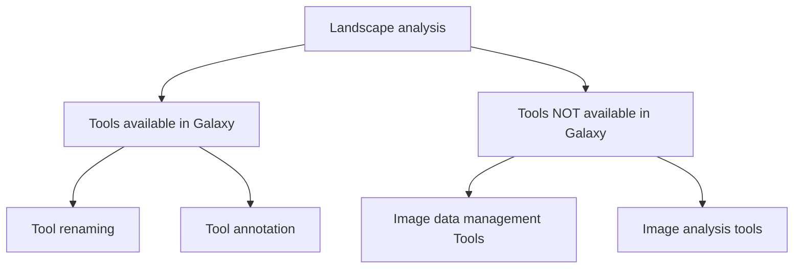

<!--
The paper.md, bibtex and figure file can be found in this repo:

  https://github.com/journal-of-research-objects/Example-BioHackrXiv-Paper

To modify, please clone the repo. You can generate PDF of the paper by
pasting above link (or yours) in
  http://biohackrxiv.genenetwork.org/

-->

# Introduction

The [BioHackathon Europe](https://biohackathon-europe.org/) took place in Barcelona in November 2023, where a group of people interested in image data analysis gathered around the project **_"Enhancing the image analysis community in Galaxy"_**.

Although the [Galaxy platform](http://galaxyproject.org) [@Galaxy] has a strong presence in omics fields like genomics and proteomics, it has yet to fully establish itself in the imaging community. At the moment, **efforts** to integrate tools and create workflows for image analysis in Galaxy **are scattered** across research fields and locations.

The vision of this project is not only to join those efforts but also to go beyond by creating **cross-discipline image analysis resources**. By fostering collaboration among scientists and enthusiasts from different fields we aim to create a dynamic community around image data management and analysis.

The initiative started in summer 2023 when the group gathered around a newly-created **Expert Group on _FAIR Image Data Workflows_** within [Euro-BioImaging](https://www.eurobioimaging.eu/), the European Research Infrastructure offering open access to imaging technologies, training, and data services. Additionally, it aims to tap into the capabilities of [Simula Research Laboratory](https://www.simula.no/), a Norwegian non-profit research organization that addresses crucial scientific and engineering problems with a societal impact, focusing on five primary ICT research areas: Communication Systems, Cryptography, Scientific Computing, Software Engineering, and Machine Learning. Together, these entities will foster the development of a community dedicated to crafting FAIR computational workflows specifically tailored for image analysis.

### Project goals

For the BioHackathon 2023, we set a number of multifaceted goals:

- Gather all the existing resources for image data management and analysis in Galaxy (e.g., tools available in the [Galaxy ToolShed](https://toolshed.g2.bx.psu.edu/), training materials published in the [Galaxy Training Network](https://training.galaxyproject.org/) [@gtn], and workflows collected in the [WorkflowHub](https://workflowhub.eu/) [@workflowhub]).
- Create a list of tools widely used in the image analysis field that are not yet integrated into Galaxy.
- Annotate the existing image analysis tools that are lacking annotations with the [EDAM Bioimaging ontology](https://bioportal.bioontology.org/ontologies/EDAM-BIOIMAGING).
- Create a community of practice page in the [Galaxy Community Hub](https://galaxyproject.org/).
- Establish community practices and decide on regular interactions.

# Results

In this section, we discuss the achievements within the BioHackathon aligning them with the project goals. We explore the progress made addressing conventions, tool renaming, tool annotation, the identification of tools not available in Galaxy, together with image data management and image analysis tools.

## Landscape analysis of image analysis and image processing tools in Galaxy

The current state of image analysis and image processing tools within Galaxy, as of October 13, 2023, reveals a landscape that is both extensive and diverse. A comprehensive overview provides valuable insights into the existing ecosystem and areas that need to be enhanced.

### Tool Statistics

- **Tool count**: The _"Imaging"_ category on Galaxy Europe lists 101 tools.
- **Contributors**: Approximately 23 contributors have been involved in adding and maintaining these tools.
- **Repositories**: The tools are distributed across 5 different GitHub repositories, presenting a need for structuration and organization.
- **Categorization challenges**: Some tools with relevance to image analysis are found in the "Interactive" category, indicating a potential need for reclassification and structure clarification.

### Big pile of tools — needing structure

Following the gathering and identification of this extensive number of tools, we identified potential obstacles that could be hindering their FAIRness.

#### Example 1: Inconsistent tool naming schemes

Within the tool repository, there was a noticeable diversity in naming styles, with tools adopting various conventions such as the title case, sometimes capitalized, abbreviated, using camel case, etc. Some examples of this diversity are listed below: 

- Title Case: _Anisotropic Diffusion_, _Count Objects_, …
- Capitalized: _Binary To Points_, …
- Abbreviated: _Binary 2 Label_, …
- Camel Case: _ColorToGray_, _ConvertObjectsToImage_, …
- Regular: _Convert image_, _Find edges_, _Filter segmentation_, …
- Verb-forms vs. Nouns: _Split objects_, _Mahotas-features_, …

During the BioHackathon, we reached an agreement on a recommended naming scheme for tools, to facilitate finding these tools (see section [Conventions](#Conventions)).

#### Example 2: Low-level vs. high-level tools

The distinction between low-level and high-level tools highlights the diverse needs in the Galaxy user community. Advanced users, with a good understanding of image analysis, benefit from the flexibility and control offered by low-level tools. On the other hand, users with varying levels of expertise, including those less familiar with image analysis, find high-level tools to be easier and efficient. This duality in tool design acknowledges the heterogeneous user base within the Galaxy community. 

#### Example 3: Tools with unclear goals

The purpose of some tools can be unclear (e.g. _Gate Finder_, _Concatenate images_, _Compose two raw transformations_, _Add shadow effect_, ...), have typos in their documentation (_labeled_ vs. _labled_) or are unrelated to imaging (_GeneSeqToFamily preparation_), emphasizing the importance of defining the purpose of each tool clearly in its metadata.

Enhancing consistency in tool names and descriptions will contribute to a more user-friendly experience.

#### Example 4: Duplicated or similar tools

Some tools within the Galaxy ecosystem have similar purposes but often originate from different tool suites (e.g. _CellProfiler_ or _ImageJ_). Using prefixes or other consistent schemes for indication of the tool suites should facilitate identification and enhance user navigation.

#### Example 5: Lack of tool interoperability

Incompatibilities between tools, particularly concerning input formats and inconsistent tool IDs, were identified. For example, tools like _Count Objects_ historically accepted only TIFF inputs while others, like _Concatenate images_ exclusively accepted binary images without apparent justification. To enhance user experience and interoperability, a suggestion was made for tools to universally support formats such as TIFF and PNG. 

#### Example 6: Different versions of the same tool

Occasionally, the Galaxy tool panel may feature duplicated versions of the same tool, even if their functionalities have undergone alterations. There are different reasons for this, from typos to the way tool names are displayed in the tool panel. 

## Conventions
We acknowledge the existence of the IUC recommendations for tool names but decided for a somewhat different pattern,
1. to avoid too long tool names due to the inclusion of tool suits, 
2. to comply with the fact that many Galaxy tools in our community are thin tool wrappers around established tools (e.g., tool suites or other Conda packages), while 
3. many others implement their main functionality directly within the wrapper.

The conventions described below have a few limitations (see section [Discussion](#Discussion)).

### Naming
Generally, the name of Galaxy tools in our community should be expressive and concise, while stating the purpose of the tool as precisely as possible. Consistency of the namings of Galaxy tools is important to ensure that they can be found easily. To maintain consistency, we consider phrasing names as imperatives a good practice, like for example “Analyze particles” or “Perform segmentation using watershed transformation”. An acknowledged exception from this rule are the names of tool wrappers of major tool suites, where the name of a tool wrapper should be chosen identically to the module or function of the tool which is wrapped (e.g., “MaskImage” in CellProfiler).

### Tool description 
If a Galaxy tool is a thin tool wrapper (e.g, part of a major tool suite), then the name of the wrapped tool (and only the name of the wrapped tool, subsequent to the term “with” as in “with Bioformats”) should be used as the description of the tool (further examples include “with CellProfiler”, “with ImageJ2”, “with ImageMagick”, “with SpyBOAT”, “with SuperDSM”). This ensures that the tool is found by typing the name of the wrapped tool into the “Search” field on Galaxy EU. The tool description should be empty if a tool is either not part of a major tool suite, or the main functionality of the tool is implemented in the wrapper.

### Annotations 
We point out that there is a global list of precedential [Bio.tools](https://bio.tools/) annotations in Galaxy which outweighs the annotations made in the XML specification of a Galaxy tool (and thus the annotations of a tool reported within the web interface of Galaxy might be divergent). However, since the precedential annotations are subject to possible changes and to avoid redundant work, we do not aim to reflect those in our specifications (those which we make in the XML specifications of Galaxy tools).

## Tool annotation

The annotations of tools within the Galaxy Image Community involves  the use of the EDAM ontology and [Bio.tools](https://bio.tools/). To recognize the role of [BIII](https://biii.eu/) in the imaging tool landscape, we agreed to use [BIII](https://biii.eu/), considering its integration with EDAM-Bioimaging. 

To fully reflect this decision, we included a new metadata field in the Galaxy tool wrappers that enables the annotation of tools using [BIII](https://biii.eu/) (see [PR](https://github.com/galaxyproject/galaxy/pull/16952)).

We annotated all the tools with [Bio.tools](https://bio.tools/), EDAM and [BIII](https://biii.eu/) and adhered to the agreed conventions in the following pull requests:

- https://github.com/BMCV/galaxy-image-analysis/pull/71
- https://github.com/bgruening/galaxytools/pull/1346 
- https://github.com/goeckslab/tools-mti/pull/53
- https://github.com/galaxyproject/tools-iuc/pull/5572
- https://github.com/usegalaxy-eu/usegalaxy-eu-tools/pull/641

Thanks to these annotations and in collaboration with Project 25 _" Increasing the findability, visibility, and impact of Galaxy tools for specialised scientific Communities"_, we gathered a list of tools that are of interest for the imaging community.

We also started the discussion to facilitate the [bio.tools](https://bio.tools/) [@biotools] annotations when wrapping a tool for Galaxy using the [Galaxy Language Server](https://github.com/galaxyproject/galaxy-language-server) (see [issue](https://github.com/galaxyproject/galaxy-language-server/issues/250)).

## Data management tools

Improving data management is crucial when it comes to improving the image analysis experience in Galaxy. During the BioHackathon, we worked on adding support for Zarr ([PR](https://github.com/usegalaxy-eu/galaxy/pull/203)) and a beta version of OME-Zarr ([PR](https://github.com/galaxyproject/galaxy/issues/16862)) [@OMEzarr], with plans for adding metadata information and checks in the future. This would also facilitate adding support for other community-driven standards such as NCZarr support.

Tools to convert NetCDF to NCZarr and various proprietary image file formats to OME-Zarr were added ([PR](https://github.com/NordicESMhub/galaxy-tools/pull/64)), addressing specific image analysis data formats for better data handling in Galaxy.

In addition, a tool to fetch image data directly from the [BioImage Archive (BIA)](https://www.ebi.ac.uk/bioimage-archive/) has been implemented ([PR](https://github.com/bgruening/galaxytools/pull/1345)), and tools for data conversion have been included ([PR](https://github.com/BMCV/galaxy-image-analysis/pull/72 )).

## AI-powered image analysis

The integration of AI-powered image analysis in Galaxy involved leveraging models from the [BioImage Model Zoo (BMZ)](https://bioimage.io/#/) [@BMZ] and conducting an analysis of [ZeroCostDL4Mic](https://github.com/HenriquesLab/ZeroCostDL4Mic) dependencies. 

We explored the possibility to consume models from the [BMZ](https://bioimage.io/#/) in Galaxy, with specific examples for live cell segmentation and nucleus segmentation boundary models. 

## Community

We updated the Galaxy subdomain (https://imaging.usegalaxy.eu) to contain the list of training materials related to imaging ([PR](https://github.com/usegalaxy-eu/website/pull/1165)). We also agreed on renaming our community to “image community”, thus also renaming the subdomain to image.usegalaxy.eu.

# Discussion

The project has made good progress in gathering existing image analysis tools, creating a list of tools to integrate, and adding annotations to tools that needed them.

## Future work

Looking ahead, we plan to continue this work by collaborating closely with the Galaxy, EDAM-Bioimaging and BioImage Model Zoo communities. The long-term goal is to create a solid community that supports the creation of reproducible and FAIR image analysis workflows.

### Community development

We welcome anyone interested, from experienced Galaxy tool developers and image analysts to those who are new to the field, to join our community and monthly meetings. 

### Improving conventions 
We are aware of the following limitations of our conventions for tool naming, tool descriptions, tool and annotation (see section [Conventions](#Conventions)), which we seek to possibly address in the future:

1. If a Galaxy tool has a [Bio.tools](https://bio.tools/) identifier included in its XML specification, then its EDAM operation annotation can be inherited from the Bio.tools annotation. The EDAM operations in Bio.tools might be precedential over the EDAM operations given in the XML specification of a Galaxy tool.
2. Our main motivation for prominently exposing the name of the wrapped tool in the tool description has been to account for the fact that tools with similar functionality (and hence similar names) exist across different tool suites. However, they can also exist across different plugins within the same tool suite (such as ImageJ2). To also account for that, we might want to take the suggested scheme one step further and to also include the name of the corresponding plugin in the tool description (as in “with ImageJ2, bUnwrapJ”).

# Acknowledgements

We thank the contributions from Project 25. The authors utilised the language model ChatGPT developed by OpenAI for assistance in the structuring and drafting of this text.

# References

- [Galaxy project](https://galaxyproject.org)
- [Euro-BioImaging](https://www.eurobioimaging.eu/)
- [BioImage Model Zoo (BMZ)](https://bioimage.io/#/)
- [EDAM Bioimaging](https://bioportal.bioontology.org/ontologies/EDAM-BIOIMAGING)
- [Zarr](https://zarr.readthedocs.io/en/stable/spec.html#specifications)
- [OME-Zarr](https://ngff.openmicroscopy.org/latest/)
- [NCZarr](https://www.unidata.ucar.edu/blogs/developer/en/entry/netcdf-zarr-data-model-specification)
- [GeoZarr](https://github.com/zarr-developers/geozarr-spec)

