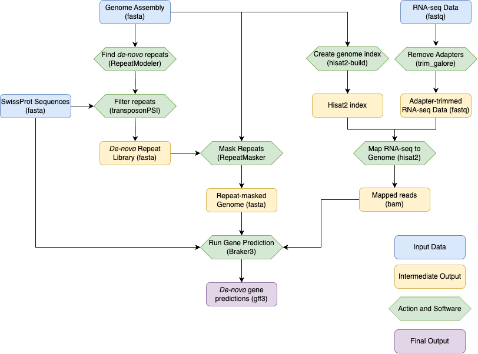
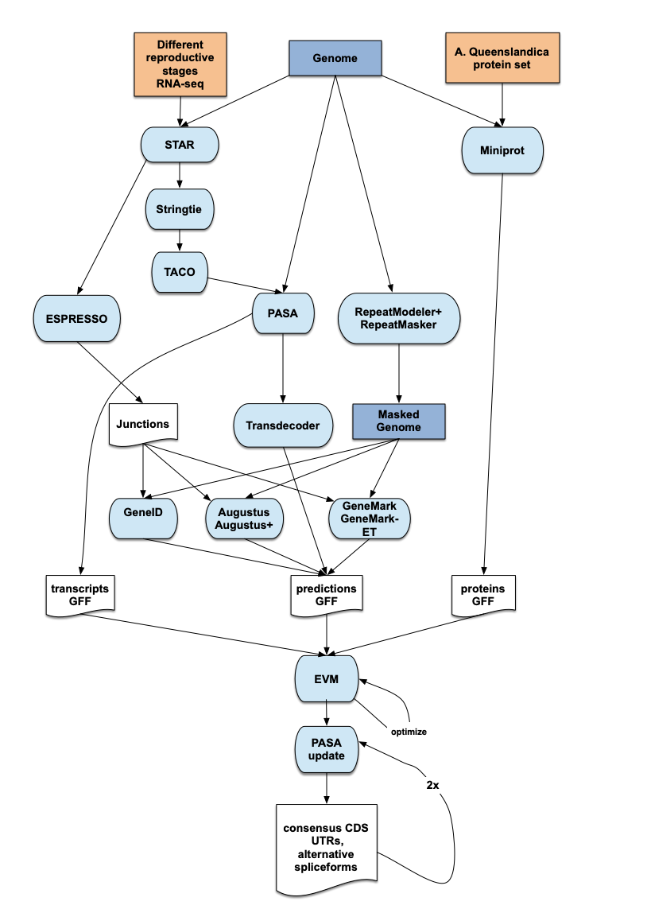

<!--

The paper.md, bibtex and figure file can be found in this repo:

  https://github.com/elixir-europe/biohackathon-projects-2023/20/biohackrxiv/

To modify, please clone the repo. You can generate PDF of the paper by
pasting above link (or yours) in

  http://biohackrxiv.genenetwork.org/

-->

# Introduction

The European Reference Genome Atlas (ERGA) is an international consortium
of over 700 researchers from across Europe who are committed to cataloguing
eukaryotic biodiversity through the generation of high-quality reference
genomes as a response to declines in biodiversity. Development and implementation
of standard procedures and bioinformatic pipelines is essential for achieving ERGA’s goal.

Annotation of reference genomes is necessary for many downstream analyses,
but tools and workflows for genome annotation are still neither performed
in a consistent manner between research groups, nor prepared for scaling
up to the thousands of genomes which are to be produced as part of ERGA’s efforts.
As the number of sequenced genomes is rapidly increasing, there is a great need
to develop standard, efficient and reproducible genome annotation workflows.
In this project we will develop and implement pipelines for performing and
evaluating genome annotations. As part of the Elixir BioHackathon 2023,
we identified appropriate pipeline components, created environments or containers
to facilitate their installation, and embedded them into robust pipelines using
standard workflow managers, in this case Nextflow, Snakemake and Galaxy.

## Goals

<b>Testing pipelines on a wide range of species</b>
The majority of tools developed for the annotation of genetic sequences have been
developed with model organisms in mind. We wished to determine which tools and pipelines
were appropriate for which taxa and what limitations exist with established tools.
<b>Testing different pipelines and workflows on a variety of compute infrastructures</b>
A key aspect of the FAIR principles is the interoperability of metadata, data and workflows.
Any pipeline produced by researchers should be written wherever possible in a way that can be
deployed on a variety of compute infrastructures with minimal intervention and trouble-shooting.
This BioHackathon gives a fantastic opportunity for researchers from a large number of institutes
and research environments to come together and share their experiences on different compute environments.
<b>Establish a set of criteria to evaluate the efficacy of each pipeline</b>
The evaluation of genome annotation remains an outstanding question in the field,
with no defined set of tools, software and criteria yet established to determine whether one
annotation is necessarily better than another. In this project, we aimed to test a number of tools
and establish a set of easily comparable criteria for assessing annotation quality.
<b>Establish a "minimum criteria" for annotation quality</b>
As ERGA and other Earth Biogenome Project-affiliated initiatives increase the number of published
genome sequences, the compute cost required in order to evaluate and annotate these sequences
will grow inordinately. We must keep in mind as researchers that Earth’s resources are finite
and must be aware of our environmental impact with each computational pipeline run. It is not
feasible to be expected to run multiple workflows for each generated sequence in order to produce
the best annotation possible. We hope to establish when an annotation can be considered “good enough”
to answer the biological questions researchers have for their genome to avoid over-computation in the future.

# Genomes for Biodiversity

As part of this project, we wished to test robust annotation pipelines on genomes
representing the diversity of organisms which will be produced as part of ERGA’s goal
to produce reference quality genomes for all eukaryotes in Europe. Included in this project
were a mixture of previously published genomes, as well as assemblies produced as part of the
ERGA Pilot Project (https://doi.org/10.1101/2023.09.25.559365) or by ERGA-affiliated researchers
directly contributing to the BioHackathon. Included in our analysis were genome sequences for the
Cauliflower Coral Pocillopora meandrina, the Violet Copper Butterfly Helleia helle, the Lesser Trefoil 
Trifolium dubium (GCA_951804385.1), the sponge Phakellia ventilabrum, the Coffee-bean Snail Melampus jaumei,
the Fruit Fly Drosophila melanogaster (GCA_000001215.4), and Chromosome 19 from Human Genome Release 38 (GCA_000001405.29).

# Pipeline Structure(s)

The pipelines generated as part of this BioHackathon generally followed a consistent workflow,
relying on a repeat-masked genome, species-specific transcript sequencing data, a database of
protein sequences and software aimed to identify and predict de-novo gene structures based on the given evidences.

Our first tested pipeline (Fig. X - hereafter referred to as UNIL pipeline, developed by SJD
 includes mappings from paired-end RNA-seq data specific to the species of interest and proteins from the
Swissprot database (Release 2023_04 of 13-Sep-2023). Following de-novo repeat modelling using the genome assembly
as input, the Swissprot protein sequences and mapped RNA-seq reads are given as evidence data alongside the repeat-masked
genome into Braker3. The resulting gff3 file is the output used for downstream evaluation and analysis.

Our second tested pipeline (Fig. X - hereafter referred to as CNAG pipeline, developed by JGG) includes additional
steps where a set of de-novo transcripts are assembled from the input RNA-seq reads and multiple evidences from Augustus,
GeneMark and GeneID are combined with RNA-seq and protein alignments using EvidenceModeler (EVM).
Furthermore isoform information is included by running PASA after initial gene models are created from EVM.

Our third tested pipeline (Fig. X - hereafter referred to as ANNOTATO, developed by PD) incorporates a
number of the previous steps and allows for the addition of long-read RNA reads, for example a PacBio Iso-seq
library, and uses Funannotate to include to add further gene predictions alongside Braker3.

## References
