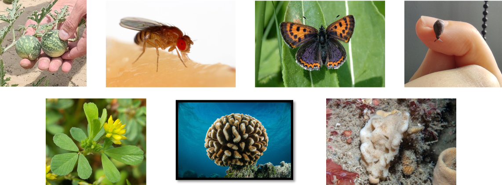
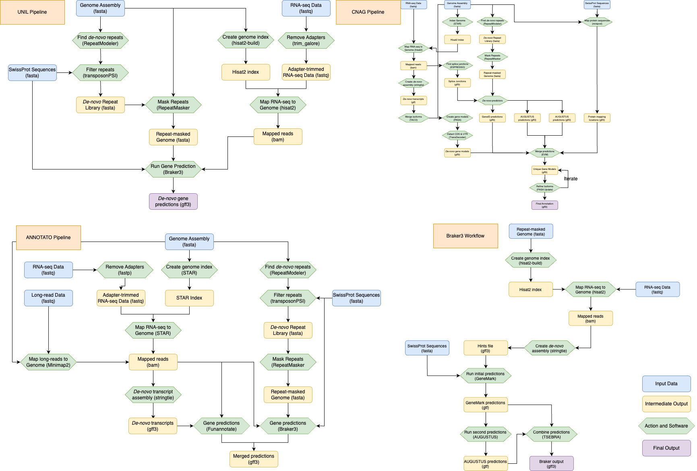
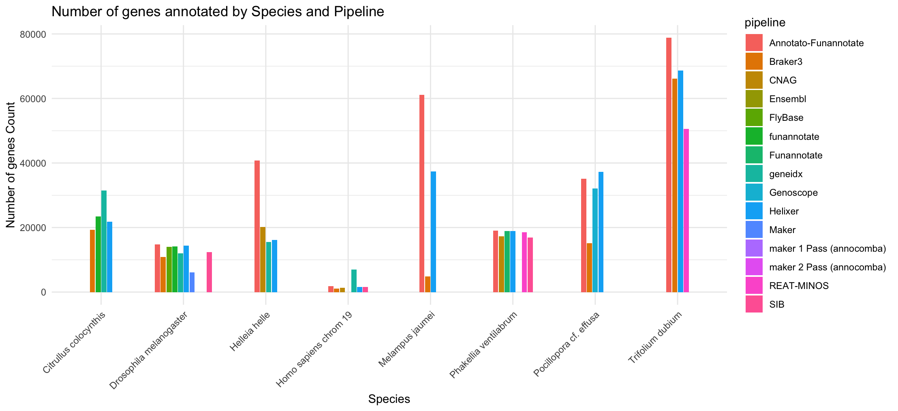
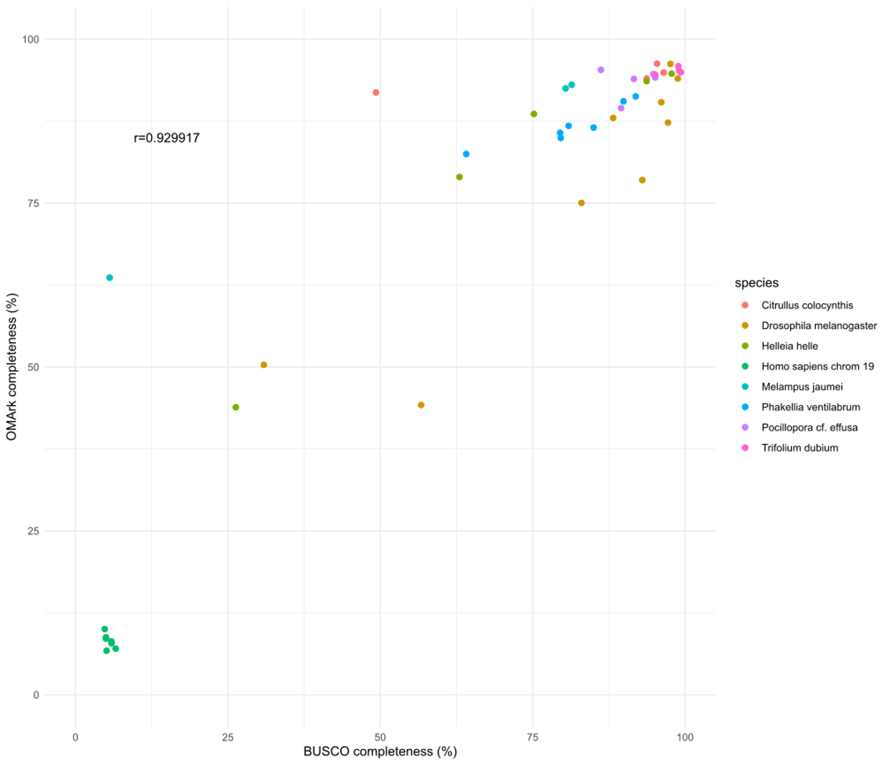
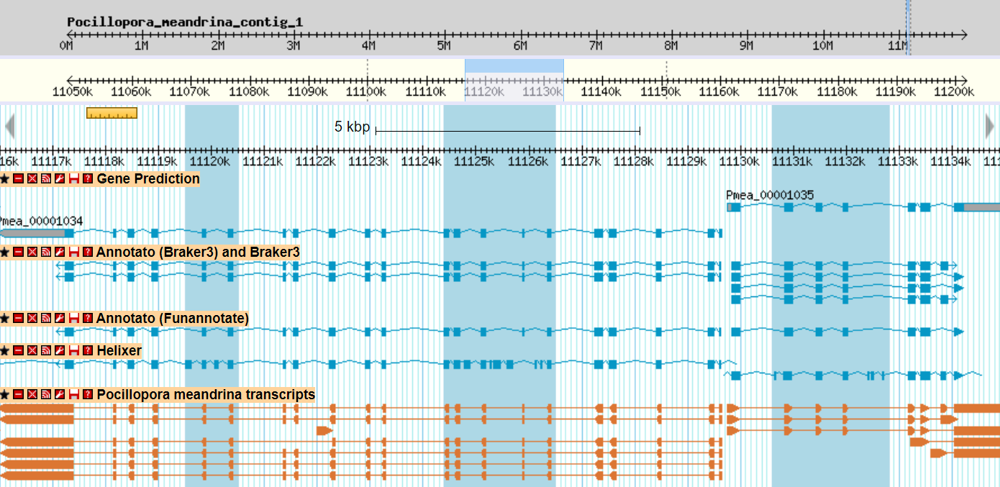
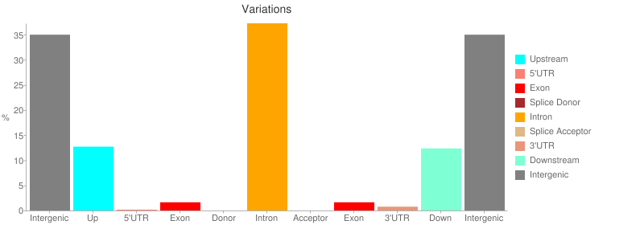
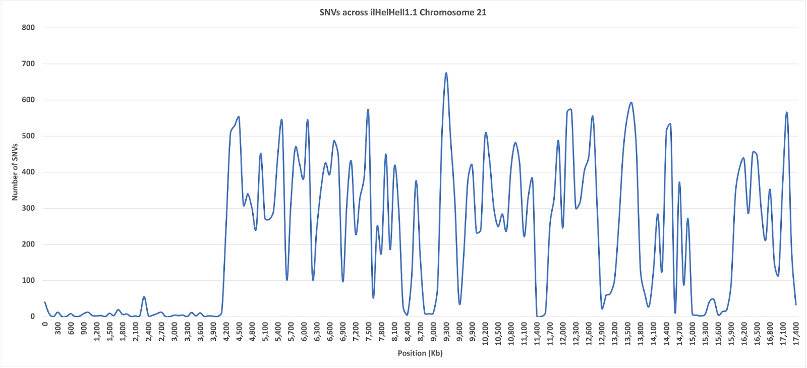

# Abstract

Rapid advances in genome sequencing technologies have resulted in an explosion of reference-quality genome assemblies across the tree of life. While these resources will be invaluable towards goals of species and biodiversity conservation, their application is limited when they lack accurate annotations of their functional elements. The European Reference Genome Atlas (ERGA) is the European node of the Earth Biogenome Project (EBP) and aims to share resources and knowledge to create fully-annotated reference genomes. ERGA strives to do this in a distributed manner, bringing together researchers from across the world, with common goals and understandings. 

In the BioHackathon Europe 2023, we came together to construct and test tools, pipelines and workflows for annotating protein-coding regions in assembled genomes. We specifically aimed to evaluate (a) the performance in a wide variety of non-model organisms and (b) the “usability” of pipelines for newcomers to annotation. This work required installing and implementing tools in a number of computational environments and infrastructures, sharing of both genomic resources and expertise between researchers from a range of institutes, and evaluation of annotation workflows performance and what input data is required in order to achieve a high quality genome annotation. Here we present the results of over 20 researchers in 8 time-zones working towards a robust implementation of genome annotation workflows in eukaryotic organisms.

# 1 Introduction

Genome annotation is the process of identifying the functions of different pieces of a genome; which includes genes that code for proteins, their intron-exon structure, and non-coding features of the genome, such as promoters and transposable elements. Annotations are typically generated using computational methods, sometimes followed by manual curation.

Producing high-quality annotations remains a challenging step in reference genome production due to data availability and the implementation of often complex pipelines. The first issue, data availability, is due to cost and technical limitations in generating sufficient evidence for annotation. This includes transcriptomic and protein sequence data from the focal species, databases, and predictive models of repeats. Once evidence is generated and acquired, the most accurate genome annotation pipelines require advanced installation and running skills, often in High Performance Computing environments. This creates the second issue, where a steep learning curve often prevents researchers from producing an annotation of the desired quality, or even beginning the task due to its daunting nature.

These limitations have knock-on effects, especially: (1) implementation issues lead to inconsistent method use across taxa, hindering comparative work, and (2) file format differences hinder deposition in public databases. Thus, the development of easily installed, reproducible pipelines with standardised outputs will greatly advance annotation in non-model organisms, and new tools are now emerging with this in mind.

Lastly, there remain few tools to assess the quality of an annotation, and efforts should be made to improve this. The main issue stems from a lack of ground-truth on which to evaluate the results of annotation pipelines. Current methods in assessing gene content (e.g., BUSCO [@BUSCO] or OMArk [@OMArk]) are invaluable, but as they are based on comparison with previously annotated reference genomes they are not well fit for under-represented species in which these gene sets may not reflect completeness. Sequencing and annotating more genomes will help improve this, as filling in phylogenetic gaps will provide more opportunities for comparisons among taxa and to better predictive gene model development.

Despite these challenges, it is important that research teams annotate their genomes. Many downstream analyses are based solely on the predicted genes from the annotation, and incomplete or incorrect results will negatively impact studies of both short-term and broad evolutionary processes.

The European Reference Genome Atlas (ERGA [@ERGA]) is an international consortium of over 1,000 researchers from across Europe who are committed to cataloguing eukaryotic biodiversity through the generation of high-quality reference genomes as a response to declines in biodiversity. Development and implementation of standard procedures and bioinformatic pipelines are essential for achieving ERGA’s goal.

This report is the outcome of a project at the Elixir BioHackathon Europe 2023 titled “Genome annotation and other post-assembly workflows for the tree of life” with a focus on pipelines for performing and evaluating genome annotations. As part of the Elixir BioHackathon Europe 2023, we developed, tested, and benchmarked pipelines using standard workflow managers, in this case, Nextflow, Snakemake, and Galaxy, aimed at annotating protein-coding regions of reference genomes.

## 1.1 Goals

The BioHackathon was a unique opportunity for researchers from across the world to come together both in-person and via tele-communications to work towards the common goals of testing and implementing robust pipelines for genome annotation in a distributed manner, both as developers and as end-users. With this in mind, we established a number of goals for the 4 days we spent together:

**Testing pipelines on a wide range of species** The majority of tools developed for annotating genetic sequences have been developed with model organisms in mind. We wished to evaluate their performance on diverse taxa and explore their limitations.

**Testing different pipelines and workflows on a variety of computing infrastructures** A key aspect of the FAIR principles is the interoperability of metadata, data, and workflows. Any pipeline produced by researchers should be written wherever possible in a way that can be deployed on various computing infrastructures with minimal intervention and troubleshooting. This BioHackathon gave a fantastic opportunity for researchers from a large number of institutes and research environments to come together and share their experiences in different computer environments.

**Establishing annotation workflows on Galaxy** Many genome annotation tools are now available in Galaxy. Our goal was to test these tools on real data with various parameter combinations and to define real-world genome annotation workflows usable on thousands of newly sequenced genomes.

**Explore the impact of performing annotations with and without transcript evidence** For some taxa, this is not available, and it is important to determine if accurate annotations can still be created.

**Establish a set of criteria to evaluate the efficacy of each pipeline** The evaluation of genome annotation remains an outstanding question in the field, with no defined set of tools, software, and criteria to determine whether one annotation is necessarily better than another. We aimed to test a number of metrics to establish a set of easily comparable criteria for assessing annotation quality.

**Establish a "minimum criteria" for annotation quality** As ERGA and other Earth Biogenome Project-affiliated initiatives increase the number of published genome sequences, the compute cost required to evaluate and annotate these sequences will grow inordinately. As researchers, we must keep in mind that Earth’s resources are finite and must be aware of our environmental impact with each computational pipeline run. It is not feasible to be expected to run multiple workflows for each generated sequence in order to produce the best annotation possible. We hope to establish when an annotation can be considered “good enough” to answer the biological questions researchers have for their genome to avoid over-computation in the future.

**Annotating Single Nucleotide Variants in Protein-Coding Genes** De novo genome assemblies that also include Illumina sequencing present the opportunity to analyse genome-wide variation from the “reference” specimen. Here, we ran the nf-core/sarek Nextflow pipeline on a non-model species to identify Single Nucleotide Variants (SNVs) and annotate these variants in protein-coding genes. The genomic catalogue of SNVs produced in this manner can enrich the genome annotations, providing a “snapshot” of standing genetic variation.

# 2 Methods

## 2.1 Genomes for Biodiversity

As part of this project, we aimed to test robust annotation pipelines on genomes representing the diversity of organisms. This effort aligns with ERGA’s goal to produce reference-quality genomes for all eukaryotes in Europe. Included in this project were a mixture of previously published genomes, as well as assemblies produced as part of the ERGA Pilot Project [@Pilot] or by ERGA-affiliated researchers directly contributing to the BioHackathon. Included in our analysis were genome sequences for the Cauliflower Coral *Pocillopora cf. effusa* (GCA_942486045.1 [@Noel2023]), the Violet Copper Butterfly *Helleia helle* (GCA_963853865.1), the Lesser Trefoil *Trifolium dubium* (GCA_951804385.1), the Sponge *Phakellia ventilabrum* (GCA_963921505.1), the Coffee-bean Snail *Melampus jaumei*, the Fruit Fly *Drosophila melanogaster* (GCA_000001215.4), and the Bitter Apple *Citrullus colocynthis*.

{ width=100% }

## 2.2 Pipeline Structures

The pipelines used in this BioHackathon generally followed a consistent workflow, including repeat-masking of the genome assembly, using species-specific transcript sequencing data to construct transcript models (where applicable), a database of protein sequences to find conserved proteins in the genomes, and software aimed to identify and predict de-novo gene structures based on the given evidence.

The tested pipelines fell into two broad categories:

### Gene prediction using pipelines that do not require transcriptomic evidence. 

**Pipeline 1.1:** Using the genome assembly and the taxid of the species of interest as input, GeneidX [@GeneidX] provides a first-pass annotation of the protein-coding genes. Geneidx automatically identifies a set of proteins from closely related species used as hints for the gene annotation process. In addition, it also looks for the closest pre-trained parameter file from which it will extract the remaining parameters that cannot be automatically estimated from the protein-to-DNA alignments.

Geneidx can mask repeats using the repeats found by Ensembl in the closest species annotated so far (this option is turned off by default).

<https://github.com/guigolab/geneidx>

**Pipeline 1.2:** Helixer [@Helixer] is a recent ab-initio annotation software based on deep neural networks, dedicated to the annotation of large eukaryotic genomes using only the genome assembly as input.

<https://github.com/weberlab-hhu/Helixer>

### Gene prediction using pipelines that incorporate evidence from transcriptomic sequencing data or available protein sequences

**Pipeline 2.1: UNIL pipeline** developed by SJD from University of Lausanne (Fig. 2) includes mappings from paired-end RNA-seq data specific to the species of interest and proteins from the SwissProt database (Release 2023_04 of 13-Sep-2023 [@Uniprot]). Following de-novo repeat modelling, using the genome assembly as input, the SwissProt protein sequences and mapped RNA-seq reads are given as evidence data alongside the repeat-masked genome into Braker3 [@Braker3]. The resulting gff3 file is the output used for downstream evaluation and analysis.

<https://github.com/sdind/genome_annotation_workflow>

<https://doi.org/10.48546/workflowhub.workflow.569.1>

**Pipeline 2.2: CNAG Pipeline** developed by JGG from CNAG  (Fig. 2) includes initial steps where a set of de-novo transcripts are assembled from the input RNA-seq reads and multiple evidences from Augustus [@Stanke2008], GeneMark [@Brna2020] and GeneID [@Alioto2018] are combined with RNA-seq and protein alignments using EvidenceModeler (EVM [@EVM]). Furthermore, isoform information is included by running PASA [@PASA] after initial gene models are created from EVM.

<https://github.com/cnag-aat/Annotation_AAT>

**Pipeline 2.3: ANNOTATO Pipeline** developed by PDD from Genoscope (Fig. 2) incorporates a number of the previous steps and allows for the addition of long-read RNA reads, for example, a PacBio Iso-seq library, and uses Funannotate [@Funannotate] to add further gene predictions alongside Braker3.

<https://doi.org/10.48546/workflowhub.workflow.654.2>

**Pipeline 2.4: REAT-MINOS** developed by the DS group generates alignments and gene models by multiple methods (including: Mikado [@Venturini2018], Augustus [@Stanke2008], EvidenceModeler (EVM [@EVM]) and Helixer [@Helixer] with a final set of gene models selected based on evidence support. In addition, models are assigned a confidence classification and biotype.

<https://github.com/EI-CoreBioinformatics/reat> and <https://github.com/EI-CoreBioinformatics/minos>

{ width=100% }

## 2.3 How to Evaluate Your Genome Annotation

A fundamental outstanding question in the field of genome annotation is how to evaluate the quality of an annotation. Some key metrics to consider are the number of total genes annotated, which is itself taxon-specific, the number and size of introns, the latter normally being correlated with the size of the genome, the number of single-exon genes, the number of distinct isoforms per gene, and the completeness of the annotation regarding the expected content of the proteome which is encoded. 

To evaluate the completeness of the annotated proteome, we utilised BUSCO and OMArk. Both of these tools are designed to determine what proportion of protein-coding genes expected to be present in the genome from an ancestral lineage are present in the annotated sequences. OMArk also indicates whether annotated sequences are potentially from contaminated sources, inconsistent with the identified lineage, or have no known homologs. The metrics of “Gene Completeness” output by both BUSCO and OMArk are vital in identifying whether the annotation created fully represents the proteome of the species and is particularly useful in comparing two annotations performed on the same genome.

Gene completeness metrics such as BUSCO and OMArk can be skewed by over-predicting genes. Thus, the number of genes predicted as part of an annotation pipeline is also a key metric in determining annotation quality to quantify if the gene content is overestimated. With this in mind, we aim to produce annotations with similar numbers of genes found in annotations from other genomes in the clade. The “Consistency” output of OMArk can then help identify the reason for overprediction: whether inclusion of translated non-coding regions (Overrepresentation of Unknown) or fragmentation of genes (Overrepresentation of fragmented sequences).

## 2.4 Computation in Galaxy

All Galaxy analyses were performed on the European Galaxy server <https://usegalaxy.eu> using the pre-installed tools listed in Table 1. In all instances, the source code used to call each tool is available in the Galaxy Toolshed URL, or can be accessed via the GitHub repositories used by the Galaxy Genome Annotation community (for further details see <https://annotation.usegalaxy.eu/>). The versions for each tool are defined by the conda packages and environment used. Parameters and data used for each run are available within the metadata of the Galaxy Analysis Run.

| Tool                         | Galaxy Toolshed URL                                                                                                         |
|------------------------------|-----------------------------------------------------------------------------------------------------------------------------|
| RepeatMasker                 | <https://usegalaxy.eu/root?tool_id=toolshed.g2.bx.psu.edu/repos/bgruening/repeat_masker/repeatmasker_wrapper/4.1.5+galaxy0> |
| RepeatModeler                | <https://usegalaxy.eu/root?tool_id=toolshed.g2.bx.psu.edu/repos/csbl/repeatmodeler/repeatmodeler/2.0.4+galaxy1>             |
| Red                          | <https://usegalaxy.eu/root?tool_id=toolshed.g2.bx.psu.edu/repos/iuc/red/red/2018.09.10+galaxy1>                             |
| Helixer                      | <https://usegalaxy.eu/root?tool_id=toolshed.g2.bx.psu.edu/repos/genouest/helixer/helixer/0.3.2>                             |
| Braker3                      | <https://usegalaxy.eu/root?tool_id=toolshed.g2.bx.psu.edu/repos/genouest/braker3/braker3/3.0.3+galaxy2>                     |
| Funannotate                  | <https://usegalaxy.eu/root?tool_id=toolshed.g2.bx.psu.edu/repos/iuc/funannotate_predict/funannotate_predict/1.8.15+galaxy3> |
| Maker                        | <https://usegalaxy.eu/root?tool_id=toolshed.g2.bx.psu.edu/repos/iuc/maker/maker/2.31.11+galaxy2>                            |
| Genome Annotation Statistics | <https://usegalaxy.eu/root?tool_id=toolshed.g2.bx.psu.edu/repos/iuc/jcvi_gff_stats/jcvi_gff_stats/0.8.4>                    |
| BUSCO                        | <https://usegalaxy.eu/root?tool_id=toolshed.g2.bx.psu.edu/repos/iuc/busco/busco/5.4.6+galaxy0>                              |
| GFFread                      | <https://usegalaxy.eu/root?tool_id=toolshed.g2.bx.psu.edu/repos/devteam/gffread/gffread/2.2.1.3+galaxy0>                    |
| JBrowse                      | <https://usegalaxy.eu/root?tool_id=toolshed.g2.bx.psu.edu/repos/iuc/jbrowse/jbrowse/1.16.11+galaxy1>                        |
Table 1: List of Tools Used by the Galaxy Annotation Community and Their Installation Locations in the Galaxy Toolshed.

## 2.5 SNVs in protein-coding genes

To examine variant calling as a metric of genome annotation, single-nucleotide variants (SNVs) were annotated in the protein-coding genes that were previously annotated by the CNAG pipeline on the *Helleia helle* genome assembly. For this, we used 83x Illumina PE reads (available in the European Nucleotide Archive; ENA under project accession number PRJEB64646) that were first processed by Cutadapt v3.2 [@Martin2011] to remove any remaining adapter sequences and used to estimate error-rate, heterozygosity and genome size with Meryl [@Meryl] and Genomescope2 [@RanalloBenavidez2020].

The nf-core’s [@Hanssen2023] Sarek v3.2.2 [@Garcia2020] pipeline was run locally using Nextflow v23.10.0 [@Ewels2020] with Apptainer 1.1.6-1.el7 (<https://apptainer.org/>) to perform Germline Variant Calling following the GATK best practices to call SNVs (<https://gatk.broadinstitute.org/hc/en-us/articles/360035535932-Germline-short-variant-discovery-SNPs-Indels->). 

After examining the coverage statistics reported by Sarek’s usage of Mosdepth [@Pedersen2017], a total of 544,884,244 bp (99.6% of the genome) callable sites were reported. Variants not annotated in callable sites, were filtered out from the VCF produced after haplotype calling with Sarek. Finally, SNVs were annotated using snpEff v5.2.0 [@Cingolani2012].  

# 3 Results

## 3.1 Protein-Coding Genome Annotation

## 3.1.1 Number of Genes per Annotation

The number of genes annotated by a pipeline is a good measure of over- or under-prediction in gene models. While no ground truth is typically known a priori, comparisons between workflows can provide a good basis for discarding outliers. This was our first criteria for evaluating the accuracy of an annotation (Fig. 3).

{ width=100% }

In the workflows tested, ANNOTATO was found to predict many more genes than all others, giving initial indications that the workflow is over-predicting. Running Braker3 alone consistently resulted in a lower number of annotated genes, indicating either genes being missed in the annotation process, or being removed due to strict filtering criteria.

Despite this variation, what is notable is the overall consistency shown in the numbers of genes predicted within each species. The workflows and tools tested were often built on a range of assumptions and models, yet seem to converge towards an average in this regard. A more in-detail analysis of the number of genes and exons, the size of genes, introns and exons gives a more fine-detail overview of the differences between annotations. For *Pocillopora cf. effusa*, such statistics can be seen in Table 2. In particular, this shows Braker3 greatly under-predicting genes and Helixer over-predicting in relation to the reference genome annotation submitted by Genoscope. High degrees of variation between the sizes of introns and the sizes of predicted genes indicate avenues for further downstream investigation, to determine which annotations are producing those closer to the "ground truth"

|Metrics|Genoscope|Annotato-Funannotate|Helixer (galaxy)|Braker3 (galaxy)|
|-|-|-|-|-|
|# of genes (% without intron)|32,095 (16.6%)|33,086 (12.3%)|37,258 (17.7%)|15,469 (11.1%)|
|Gene size (mean./med.) (nt.)|5,865 / 3346|4,594 / 2,873|5,577.03 / 3,658|6,336.47 / 4,395|
|Gene size without UTR (mean./med.) (nt.)|5,325 / 2,802|4,594 / 2,873|4,600.35 / 2,665|6,336.47 / 4,395|
|# of exons/genes (mean./med.)|6.53 / 3|6.98 / 4|7.97 / 5|8.18 / 5|
|# of exons from spliced genes/gene (mean./med.)|7.64 / 4|7.82 / 5|9.48 / 6|9.07 / 6|
|CDS size (mean./med.) (nt.)|1,458.40 / 993|1,357 / 940|1,415.23 / 999|1,457.37 / 1,155|
|CDS size from spliced genes (mean./med.) (nt.)|1,558 / 1,164|1,418 / 1,059|1,502.31 / 1,167|1,511.16 / 1,281|
|# of introns|177,586|197,815|259,865|111,025|
|Intron size (mean./med.) (nt.)|699 / 461|541 / 422|456.66 / 313|679.80 / 479|
Table 2: Evaluation of *Pocillopora cf. effusa* annotations. First column shows reference annotation submitted by Genoscope

## 3.1.2 Proteome Accuracy and Completeness

To evaluate the completeness of the annotated transcript- and proteome, we relied on BUSCO and OMArk to determine what proportion of the expected annotated sequences for a species in its lineage were recovered. The BUSCO scores calculated were all given for the most representative lineage for each species (*Citrullus* - eudicots, *Drosophila* - diptera, *Helleia* - lepidoptera, Human - primates, *Melampus* - mollusca, *Phakellia* & *Pocillopora* - metazoa, *Trifolium* - fabales) with each pipeline showing differing degrees of completeness for each species (Fig. 4). For our most represented species, *Drosophila melanogaster,* most methods did not achieve a level of completeness as high as the curated reference annotation, which outlines the limit of automated methods.

From other species, of particular note is the necessity to run multiple rounds of MAKER in order to obtain a meaningful annotation regardless of the species used. A positive surprise was the remarkable success of most workflows run to annotate both copies of each gene expected in the tetraploid *Trifolium dubium*, as reflected in the overall number of genes (Fig. 3) and proteome completeness scores given by BUSCO and OMArk (Figs. 4 & 5).

For most species analysed, the annotations with better BUSCO scores were created using direct evidence, either via transcript data or protein sequences, with the exception of the *de-novo* program Helixer. Remarkably, without this evidence Helixer was able to obtain highly complete annotations across diverse taxa (Figure 4) even without the use of a repeat masked genome, and only requires a choice of lineage as input parameter (choice of land plant, vertebrate, invertebrate, or fungi), meaning incredible ease-of-use and lower compute costs, however with the requirement of a GPU.

{ width=70% }

Similar results were found when evaluating the annotations with OMArk (Fig. 5). Similar to BUSCO, the completeness of each annotated proteome was evaluated against the lineage most relevant for each species (*Citrullus* - fabids, *Drosophila* - melanogaster subgroup, *Helleia* - Papilionoidae, Human - Hominidae, *Melampus* -Lophotrochozoa, *Phakellia* - metazoa, *Pocillopora* - eumetazoa, *Trifolium* - NPAAA clade). Most scores obtained were correlated with those obtained by BUSCO (Fig. 6), with the exception of fewer duplicated sequences detected in Trifolium dubium and many more duplicated sequences found in other species. This is expected, as the OMAmer database used not exclusively contain single-copy orthologs, which is the case for BUSCO.

{ width=70% }

{ width=50% }

Of particular interest when using OMArk to evaluate an annotation is the use of the Consistency scores to determine the accuracy of the annotation (Fig. 7). Here, the results rely heavily on the completeness of the databases used and we show that a number of species are harmed by a high proportion of annotated sequences being detected as “Unknown” - i.e. not found in the existing OMAmer database (e.g. *Phakellia* and *Pocillopora*). Some of these genes are surely “real” genes with no detectable homologs, but the relative proportion of those in comparison to reference annotation of the same clades can help estimate which method is the most accurate. For example, the Braker3 annotation is the one with the closest number of Unknown genes to the reference RefSeq annotation of its sister species, *Pocillipora meandrina*. The databases themselves are reliant on the production of high-quality annotated genomes in all clades and will only improve in the future as a wider range of taxa are the focus of many reference-genome projects.

The combination of Completeness (Fig. 5) and Consistency (Fig. 7) highlights the optimisation problem surrounding Completeness and Accuracy of an annotation. For example, our tested pipelines Annotato and CNAG were found to be reasonably complete in Helleia helle compared to other tested workflows, but demonstrated a large number of sequences that were not found in existing OMAmer databases, which was not the case for the other workflows. This correlated with the higher number of genes found by both of these methods, suggesting that both of these pipelines are “over-predicting” genes in this case.  Such a high proportion of “Unknown” genes is also uncommon for reference annotations for other species of the Papilionoidae superfamily,  suggesting most of these are false positives. We suggest always considering the Consistency of an annotation with respect to the existing sequences annotated for the lineage, as well as Completeness scores, such as just using BUSCO.

{ width=70% }

### 3.1.3 Exon and CDS Structure of Predictions

The analyses presented in the previous two sections rely on summary statistics based on genome-wide approaches. While it is useful to obtain statistics regarding the number and size of genes, exons, introns, CDS and other features, this does not give us any indication of the accuracy or consistency of the locations of these features in the genome. Using BUSCO and OMArk to calculate accuracy of predicted protein sequences gives us an indication of this, but does not give us any fine-grain information.

Thus, to further compare completeness and compare annotations within species, we calculated the Sensitivity and Specificity of CDS regions predicted by 5 workflows for the C. colocynthis genome (Table 3). As expected, there is a high degree of overlap between two independent runs of Braker3, run with and without transcript data as evidence, but there is also a reasonable degree of overlap when comparing Braker, Helixer and funannotate gene predictions. The outlier in this analysis was GeneIdx, which showed low consistency with all other tested tools. However, it should be noted that GeneIdx is still under development and was not tested on plant genomes during the development stages. By contrast, Helixer was developed by researchers from a plant research institute, so the developers have a vested interest that this tool performs well on plant genomes.

| |**Braker3-galaxy**|**Braker3**|**Helixer**|**funannotate**|**geneidx**|
|-|-|-|-|-|-|
|**Braker3-galaxy**|100|91.5|85.3|85.6|33.7|
|**Braker3**|91.5|100|79.9|79.8|31.7|
|**Helixer**|85.3|79.9|100|79.5|32.1|
|**funannotate**|85.6|79.8|79.5|100|31.7|
|**geneidx**|33.7|31.7|32.1|31.7|100|
Table 3: Accuracy score comparing the predicted CDS for each gene from gene models in *C. colocynthis*. Accuracy score is calculated as (Sensitivity x Specificity) / 2

Sensitivity and Specificity analyses like those presented in Table 3 give a much better indication of which tools are consistently calling the same regions of the genome protein-coding. These scores should be combined with similar metrics based on the annotated nucleotides, exons and genes to get a full picture. However, one limiting factor is the lack of a ground-truth, so we cannot therefore assign a “best” annotation using this method. More in-depth analysis is possible by inspecting annotations manually to identify whether outliers are true annotations missed by other tools, or examples of false positive predictions. Such manual curation of annotations can be performed using JBrowse or other genome browsers to view snapshots of the genome (e.g. Fig. 8)

{ width=100% }

## 3.2 SNV Analysis

The SNV calling performed for the Helleia helle genome reported a heterozygosity rate of 0.2338%, which is low and consistent with IUCN Assessment of this butterfly as Endangered in Europe [@IUCN_butterflies]. As purifying selection is acting strongly at functional sites, most of the variants were annotated to have extremely low or negligible impact with a higher proportion of synonymous changes (Missense/Silent ratio 0.85) and the vast majority being located at introns and intergenic regions (Fig. 9).

{ width=100% }

Once all the variants have been called, interesting insights of the genome can be observed. In this case, when reviewing the amount of SNVs called throughout the whole genome, we could detect chromosomal regions where this frequency was much lower (e.g. first 4Mb of chromosome 21, Fig. 10).

{ width=100% }

The fact that the region was 99.65% callable and the repeat amount was not higher than for the rest of the chromosome, indicates that this difference in SNV frequency was not due to lower mappability. In addition, 4.88% of the variants found in the first 4 Mb of chromosome 21 were located in exons while for the rest of the chromosome just 1.87% felt in exons. Hence, the lower nucleotide diversity in this region compared to the rest of the chromosome, suggests that this pattern could be the result of multiple evolutionary or demographic events. Additional analysis would be needed to shed light on the function of this region, but that was out of the scope of this paper. In summary, the results presented here are just a proof of principle of the amount of information that we can extract from just one single individual after obtaining the reference genome and annotation. This quick variant calling and variant annotation, could be complemented with a demographic analysis (e.g. PSMC) or ontology term enrichment analyses. This can open the door to further investigations with the sequenced specimen and resequencing data from more individuals of the same species.

# 4 Discussion

## 4.1 Overview of computational approaches

The strength of this BioHackathon project lies in the preparation performed beforehand - particularly in finding and sharing datasets from a variety of species, each collected, sequenced and processed in different locations around the world. This effort relied on the openness of each individual involved and collaboration with sites willing to assist with computational infrastructure. We are indebted to the Barcelona Supercomputing Centre (BSC) and the National Centre for Genomic Analysis (CNAG) in Barcelona for providing Nextcloud and ftp instances, respectively, to allow users to upload, share and download the large datasets required to test each annotation pipeline. We are further grateful to the Galaxy Europe team in Freiburg for assistance with computational resources and use of the installed software inside the Galaxy framework.

As mentioned above, the willingness of all participants to share not only their biological data, but also their experiences and expertise resulted in a fruitful experience. This allowed researchers at all career stages to have direct communication and feedback with individuals responsible for developing tools in the field of genome annotation and in applying these tools to all branches of the tree of life. With this in mind, our first recommendation would be for researchers with common goals to engage in such efforts in the future, because open exchange of ideas and experiences can clearly lead to more productive outcomes in these group settings.

In Galaxy, we tested four annotation tools - Helixer, Braker3, Maker, and Funannotate, on up to 6 of the ERGA genomes. Some of the analyses did not finish within the time, but some general conclusions can be drawn. Firstly, we had great success with the tool Helixer. This required no additional input data (such as RNAseq and/or protein evidence), was much faster than other tools, and achieved comparable annotation accuracy according to BUSCO and OMArk scores. Helixer is configured to run on GPUs and uses deep learning to predict gene structures. We had success with Braker3, but it was slower than Helixer. There were some issues with Maker and Funannotate. Firstly, these tools took a lot longer to run (or did not finish), sometimes failed due to unknown reasons (or still under investigation), or required additional work on input files (such as editing contig names, which mean they are not comparable with other annotations run on the same genome). These are general conclusions but provide a useful basis for further tool refinement and prioritisation. We are now collating all these tools into a combined Galaxy workflow that will include: repeat masking, RNAseq mapping, structural annotation (multiple tool options), functional annotation, assessment, and visualisation of genome + annotation(s) on JBrowse. 

## 4.2 Major issues identified

The pipelines developed and tested as part of this BioHackathon were complex and relied on a number of tools being installed, often inside conflicting containers. There is a general movement in bioinformatics away from individually installed software and conda environments, towards singularity and docker containers encompassing entire workflows. In these cases, installation is generally simpler, more robust and more transferable between computing systems. Within a closed system such as Galaxy, each software is installed separately beforehand and can then be chained together into workflows without the need to worry about installing tools from scratch or clashing dependencies.

Genome quality is a major hurdle to creating a high-quality annotation and before using any of these workflows, the genome and the evidences used for annotation must be evaluated for quality beforehand. In our case, we identified that the sequenced transcript data for *Trifolium* was highly contaminated and resulted in the majority of the sequencing data being discarded before starting. 

In order to robustly compare annotations, as many steps as possible should be standardised. The area where we have the most control is in the evidences used guide the gene prediction process. Already at the beginning of BioHackathon, we identified that some workflows relied on the protein sequences from swissprot or uniprot and others used other databases such as orthoDB or even species-specific protein sequences. The problem becomes more complex with transcript-based data, where species-specific data is often required to obtain high-quality mappings and the complexity of the transcriptomes vary a lot between the tissue or organism sequenced.

A major roadblock in the field of genome annotation is the lack of a single agreed-upon file format for genome annotation. There exist multiple types including bed, bed12, gtf, gff3, and even many sub-types of gff file, creating further confusion and often discouraging people from public deposition. Without a consistent format output from every tool and workflow, it is almost impossible to compare the completeness and accuracy of produced annotations. A result of this is that public databases (e.g. ENA, NCBI) are not able to accept annotations as a submitted format, relying on their own in-house file format, creating further confusion. We would strongly encourage the annotation community and in particular those housed in INSDC databases to come together to agree upon a best-practice file format and create the consistency that the community is currently lacking.

A number of pipelines and workflows have been developed for human or model-organism genome assemblies. As such, applying these pipelines to genomes outside of those robustly tested can sometimes be difficult and require a high degree of manual intervention. This will likely improve as the number of high-quality non-model reference genomes are published and the biodiversity community broadens the range of taxa represented in databases such as GenBank. For now, pipelines such as nf-core’s sarek require some individual steps to be run manually in genomes not exactly conforming to those of the human reference genome.

## 4.3 Lessons learned

**Managing expectations** Each piece of software tested or run as part of the annotation workflows used here required the use of a High Performance Computing environment and would generally run for many hours. This means that once these tools are chained together into entire workflows, tasks would run on the order of days, sometimes relying on queues in clusters not being too busy or individuals having unrestricted access to large compute nodes. Coupled with the fact that some participants were also installing and running workflows for the first time, this meant that a lot of patience was initially required for trouble-shooting and for results to arrive. While the goal of the BioHackathon was to test workflows and obtain benchmarking results, we were also mindful of the importance of this week as a training and knowledge transfer exercise. It is rare to have a group of researchers from students through to experienced professionals in close proximity sharing experience and expertise in an unrestricted way.

**Organisation is key** In order to achieve our goals during the week-long BioHackathon project, a number of organisational decisions were made beforehand to allow for the smooth execution of tasks. This involved identifying complete datasets that could be shared and worked on during the week, and then establishing a common storage space where this data and resulting research outputs could be uploaded, shared, and downloaded. Finally, a subset of software, tools, and pipelines were selected, themselves determined mostly by which had been developed by members of the BioHackathon group, and then the tasks of annotating every genome with every piece of software were distributed among all members, with issues, findings and final results shared for meta-analysis at the end of the project. Having clear, short tasks distributed among individuals gave everyone a clear goal for the week of the project and increased the sense of contributing to a common goal.

**Consistency is still a dream** A repeated complaint among participants of the BioHackathon was how exactly to compare two workflows, or even the outputs from two tools. As mentioned above, the lack of a consistent annotation file format drives a large degree of confusion, but even within these files it was not always clear what was being produced. For example, does a tool only annotate protein-coding genes, or are non-coding genes also included? Some tools also include multiple splice variants for each gene, where others attempt to build the best model for each gene and only report this. This is further compounded by tools requiring different input files, either in the form of soft-/hard-/non-masked genomes, requiring transcript data or leaving this as optional, or using protein sequences from different databases. Such examples of inconsistency between tools are often not made explicit in documentation or in the commands at run-time. This thus relies on expertise from the user using each tool in order to fully understand what is being produced, making meta-analyses or comparisons incredibly difficult or almost impossible. 

**Less is more** Some pipelines or tools can run incredibly quickly and with often reduced input requirements and computational burden. While perhaps not perfect, tools such as Helixer and GeneIDx can be invaluable in quickly providing a structural annotation of a genome without the need for vast amounts of sequencing data or intensive computational experience and resources in order to run.

## 4.4 Future needs

Events such as the Elixir BioHackathon Europe offer a fantastic opportunity for researchers in a field to come together and reach consensus on a particular topic or work towards the development of a research object which will assist the wider research field. A number of issues mentioned here would be fantastic candidates for such future events, but would likely each require their own projects as the individual scopes are too large. Such topics include:

* Adding functional annotations to the structural annotations derived here. There are many tools and databases currently in use by different groups in this area and reaching a consensus or a set of best practices would be invaluable in the field of biodiversity genomics.

* A review of the current state-of-the-art in genome annotation is greatly needed, as the development of tools has been rapid over the last 10 years. While the innovation is appreciated, this has resulted in a lot of disparate methods and pipelines, without a strong idea of how one can “best” perform and evaluate an annotation.

* A definitive annotation file format. As has been mentioned many times, there is great need for a consensus file format which can be used to delineate and define functional elements of the genome. Once this has been agreed upon, sharing of these results between researchers and deposition in public repositories will become much easier.

* Define a set of quality metrics and develop tools to evaluate annotations. Already in the genome assembly field, there are generally accepted quality thresholds governing when a genome assembly can be considered “high-quality”, but this is lacking in the field of annotation.

## 4.5 Distributed BioHackathon

The Elixir BioHackathon Europe presented a rare opportunity for researchers from the Genome Annotation Community to come together and share their experiences in a free and open forum. While the foundations of the project proposed arose from work in the ERGA Annotation Committee, the participants were not necessarily involved directly in ERGA or other European projects. Researchers contributing to the project came from Australian Biocommons (an Elixir collaborative partner), the African BioGenome Project, India, and the United Arab Emirates. This not only brought together a wide variety of research experience and taxonomic diversity but also a range of computing environments and infrastructures.

A key goal of the project was to test pipelines written and developed by participating members in as many computing environments as possible. This allowed users to directly communicate with developers of pipelines and workflows, resulting in excellent channels of teaching, learning, and feedback. For bioinformatic workflows to be published in a truly FAIR manner [@FAIR] and particularly for workflows to be interoperable, this is a key step in ensuring that any dependencies, tools, software, or the workflows themselves are not written, compiled, or stored in a manner that is not accessible to all.

Another obvious advantage of having many researchers working together for an intense period on a common goal is the ability to distribute and parallelise tasks. The efficiency with which annotations could be run with multiple pipelines across multiple genome assemblies created an enriching working environment for all involved, a feeling that can sometimes be lacking in what is often an isolated working environment for many.

# Image licences:

*Helleia helle* Photo taken by James K. Lindsey at Ecology of Commanster distributed under the Creative Commons Attribution and Share Alike 2.5 Generic license

*Melampus jaumei* Photo taken by Alice B. Dennis

*Trifolium dubium* Photo taken by Kenraiz, distributed under the GNU Free Documentation License

*Phakellia ventilabrum* (Linnaeus, 1767) observed in the United Kingdom of Great Britain and Northern Ireland by Bernard Picton (licensed under http://creativecommons.org/licenses/by/4.0/)

*Drosophila melanogaster* Photo taken by Sanjay Acharya, distributed under the Creative Commons Attribution-Share Alike 4.0 International license.

*Citrullus colocynthis* photo taken by Anestis Gkanogiannis

*Pocillopora cf. effusa* photo taken by L.Thiault, Fondation Tara Expéditions

## Acknowledgements

We acknowledge access to the storage resources at Barcelona Supercomputing Center, which is partially funded by the European Union H2020-INFRAEOSC-2018-2020 program through the DICE project (Grant Agreement no. 101017207), RES (Spanish Supercomputing Network), INB (Spanish National Bioinformatics Institute).
We acknowledge access to the Galaxy Europe server which is funded by the German Federal Ministry of Education and Research BMBF grant 031 A538A de.NBI-RBC and the Ministry of Science, Research and the Arts Baden-Württemberg (MWK) within the framework of LIBIS/de.NBI Freiburg.
We thank the CNAG for providing an ftp instance to store and share the data used during this project.
We would like to thank Maxime Garcia for his help troubleshooting the nf-core/sarek runs in the slack.
Australian participants working remotely were funded by the Australian BioCommons (an ELIXIR collaborative partner), funded through Australian Government NCRIS investments from Bioplatforms Australia and the Australian Research Data Commons.
Some authors were funded by ELIXIR, the research infrastructure for life-science data, to join the BioHackathon Europe.

## References
