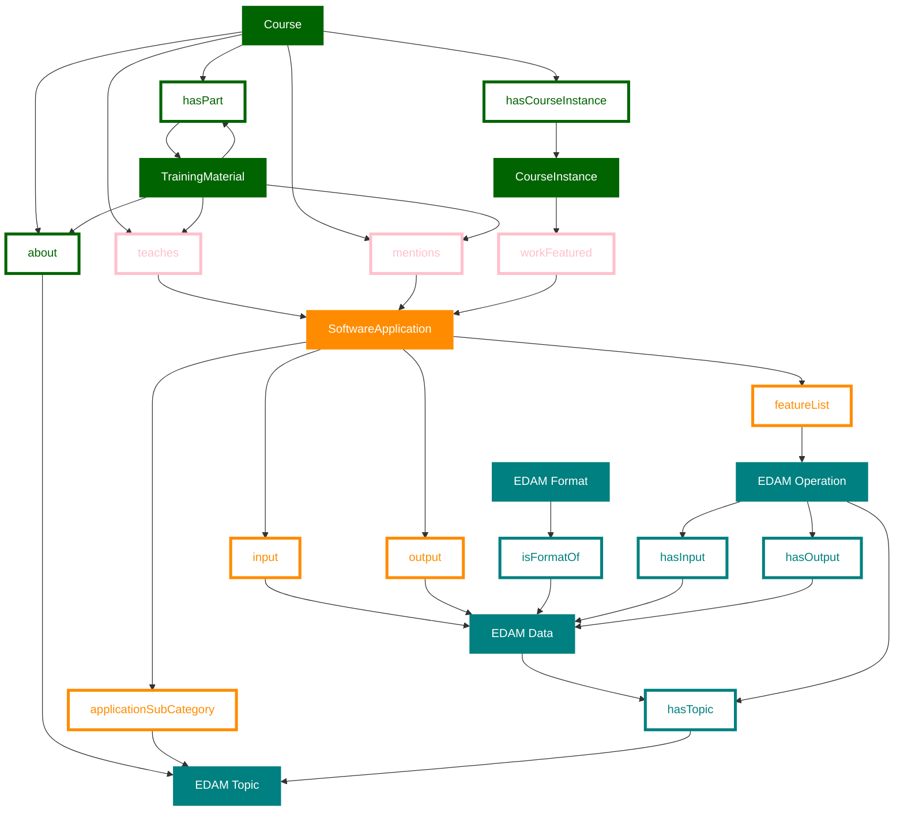

# Data model for project 32

This data model represents the data objects and links linking training and software tools as well as EDAM with bioschemas links. It summarizes have information can be linked in an interoperable way between bio.tools and TeSS, using EDAM and BioSchemas/schema.org.

