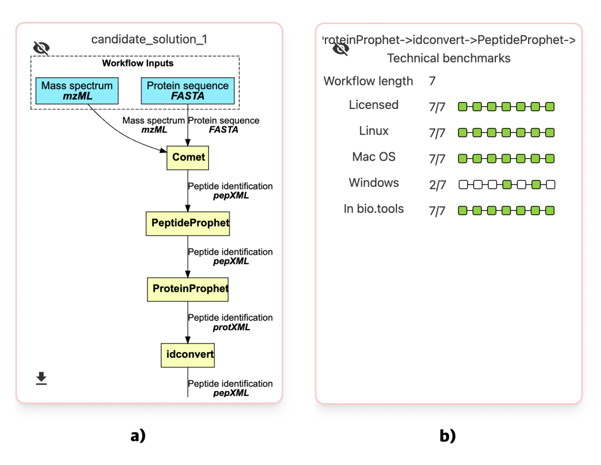
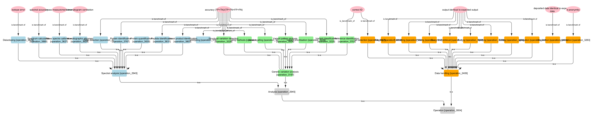

# Background

Benchmarks - standardized tests comparing performance, accuracy, and efficiency - are key for evaluating individual tools and composite workflows. In a “Bake Off” setting, they allow for comparisons of candidate tools and workflows for a particular computational task in order to determine the best-performing one [@Lamprecht:2021]. In this BioHackathon Project, we worked toward a “Great Bake Off of Bioinformatics Workflows” to develop workflow-level benchmarks and further ideas. We invited BioHackathon participants to share tools and workflows and collected their feedback and further ideas for benchmarks. Initially, the benchmarks was tested in the proteomics domain due to mature domain annotations and project lead expertise [@Palmblad:2019]. The participants' areas of expertise guided the exploration of additional domains, such as genomics. The same approach was recently applied in metabolomics [@Du:2023].

In recent and ongoing work in ELIXIR Implementation Studies and spin-off projects, we have already developed several rudimentary workflow-level benchmarks for bioinformatics data analysis pipelines, including those automatically composed by the APE (Automatic Pipeline Explorer) framework [@Kasalica:2021]. Before deploying these benchmarks for production use, however, their definitions must be aligned with benchmarks at the tool-level and formalized. This process should prioritize benchmarks that are most relevant for users when selecting, comparing, and deploying workflows for daily use. During the BioHackathon Europe 2023 project, we attempted to consolidate these efforts by bringing together people with complementary expertise and bridging ongoing ELIXIR efforts. We aim to produce a minimum fit-for-purpose set of workflow-specific benchmarks by aggregating tool benchmarks (Task 1) and assess the feasibility of annotating and mapping tool- and workflow-level benchmarks to EDAM operations to explore the reusability of benchmarks across domains (Task 2).

Short-term, the Project aimed to deliver a draft of defined workflow-level benchmarks, each with examples and defined relationships to existing tool-level benchmarks and standards. We set out to systematically discuss the different types of workflow-level benchmarks, including both design-time (related to algorithmic complexity, licenses and workflow deployability) and run-time (performance metrics). Long-term, these benchmarks will be implemented in the Workflomics project [@Kasalica:2023a] and ongoing Proteomics Community ELIXIR Implementation Studies. These workflow-level benchmarks will be carefully documented, demonstrated and shared with the research community in relevant fora and beyond this preprint.

## Task 1

In our effort to enhance the benchmarking framework for bioinformatics data analysis pipelines, we initially concentrated on consolidating benchmarks at the tool level. To achieve this, we utilized the capabilities of bio.tools [@Ison:2016] and OpenEBench [@Capella-Gutierrez:2017] APIs, allowing us to access a wealth of valuable data concerning individual bioinformatics tools.

Our primary goal was to extract key metrics for each tool, such as operating system support and licensing information. This data was then brought together to provide a comprehensive overview of the tool landscape within bioinformatics workflows. This aggregation process is an important step in understanding the practical applicability and compatibility of these tools within the broader context of data analysis pipelines.

Through seamless integration with the Workflomics interface, we made it easy for users to access and understand these aggregated statistics. Users now have the capability to toggle effortlessly between viewing the graphical representation of the workflow (see Figure 1a) and examining the relevant statistics associated with the individual tools (see Figure 1b). 

Figure 1. Workflomics interface, visualization of (a) a workflow structure, (b) aggregated workflow-level benchmarks.

Our ongoing and future work centers on refining some more intricate aggregation functions. Illustrating deeper insights into tool relationships, we aim to showcase co-citations among tools comprising the given workflows. This can be implemented using accessible tools like InSoLiTo (see https://insolito.openebench.bsc.es/) and graph theoretical measures to describe the connectedness of the tools in the workflows. Moreover, categorizing tool licenses by openness assists users in grasping legal frameworks, aiding decision-making in bioinformatics workflows and complying with open science policies. 

In conclusion, **Task 1** efforts empower users to make informed decisions when selecting, developing and deploying workflows for their specific needs.

## Task 2

In the second task of the BioHackathon, we discussed the feasibility of mapping EDAM operations to generic or specific technical and scientific run-time benchmarks fit for the purpose of comparing workflows.

During the discussions, we considered three levels of run-time benchmarks:
* Level 0: benchmarks or tests reporting if the component or workflow executed without error or crashing.
* Level 1: benchmarks for a component or workflow that can be computed from any input data
* Level 2: benchmarks for a component or workflow that require ground truth (gold standard) datasets and corresponding expected (correct) output for the component or workflow 

Level 0 may require zero input files (returning a usage string, demonstrating the tool or tools could be accessed and executed), level 1 typically requires at least 1 input file to compute a benchmark dependent only knowing the input file and EDAM operation, and level 2 typically requires at least 2 (the gold standard data and expected output/correct answer). Note that these levels do not correspond to common levels of software testing, but are specifically defined for the testing functionality of individual operations performed by a workflow, where more than one component may be responsible for the output.

### Level 1 benchmarks

The level 1 benchmarks are usually straightforward, such as checking that Format detection [operation:3357] detects a format or Aggregation [operation:3436] outputs a single file. In most cases, the operation itself immediately suggests at least one suitable benchmark that can be checked with a bash command or regular expression. Level 1 benchmarks are purely technical and have no meaningful scientific interpretation. They are similar to the kinds of tests typically performed in automated testing in continuous integration and continuous delivery  pipelines.

### Level 2 benchmarks

The level 2 benchmarks range from the straightforward, such as Format detection determining the correct format or Aggregation output identical to a file provided by the user, to the hard, such as data anonymization [operation:3283], the benchmarking of which has itself been the topic of several recent publications [@Prasser:2014][@Pilan:2022].

To inform discussions, all subclasses Spectral analysis [operation:2945] and Genetic variation analysis [operation:3197], both subclasses of Analysis [operation:2945], and Data handling [operation:2409], in total 28 specific operations in mass spectrometry/proteomics, genomics and general data handling. While some operations, such as Spectrum calculation [operation:3860] and Mass spectra calibration [operation:3627] have unique benchmarks (residual mass measurement error and spectral accuracy respectively), several benchmarks are shared across many operations. Any operation that is expected to output an identifier of a format, gene or protein sequence, or ontology class have the same generic benchmarks, namely whether the output contains an identifier of the correct type (level 1) or the correct identifier (level 2). Similarly, accuracy (fraction correct calls) is a generic benchmark for any operation identifying natural products or peptides from mass spectra, or any type of genomic variants from sequence reads. In situations where the positives and negatives are highly imbalanced, metrics such as the Matthew's correlation coefficient [@Matthews:1975], can be computed from the same information (true and false positives and negatives).

Figure 2. Mapping of level 2 benchmarks (pink ellipses) to EDAM operations in subsets of the proteomics (Spectral analysis, blue), genomics (Genetic variation analysis, green) and data wrangling (Data handling, orange) domains, suggesting a high degree of reusability of benchmarks across domains. This should be taken into account when computing and visualizing the benchmarks.

In summary, **Task 2** results, though preliminary, allow us to hypothesize (Figure 2) that the number of generic benchmarks at these levels of the EDAM ontology is an order of magnitude smaller than the number of operations. For the Workflomics project, such mappings between EDAM operations and computable benchmarks are directly useful in benchmarking of automatically generated workflows.

<!--- 

## Tables, figures and so on

Please remember to introduce tables (see Table 1) before they appear on the document. We recommend to center tables, formulas and figure but not the corresponding captions. Feel free to modify the table style as it better suits to your data.

Table 1
| Header 1 | Header 2 |
| -------- | -------- |
| item 1 | item 2 |
| item 3 | item 4 |

Remember to introduce figures (see Figure 1) before they appear on the document. 

 
Figure 1. A figure corresponding to the logo of our BioHackrXiv preprint.

# Other main section on your manuscript level 1

Feel free to use numbered lists or bullet points as you need.
* Item 1
* Item 2

--->

# Conclusion

During the BioHackathon, we made significant progress on the retrieval and aggregation of tool-level benchmarks from OpenEBench, matured the visualization and user interaction with these aggregate benchmarks in the Workflomics user interface, and discussed the feasibility of defining and mapping benchmarks to EDAM operations in different domains. Less tangible but equally important, we strengthened the embedding in the ELIXIR tools ecosystem through extensive technical discussions with experts involved with OpenEBench, EDAM, bio.tools and CWL. The efforts now continue in this larger community of stakeholders and collaborators, and will be published separately and in greater detail elsewhere.

# Future work

Given the progress acheived in this BioHackathon, we expect that the Workflomics front-end UI will soon reach a level of maturity where all must-have, major, features are implemented. The work will then focus on defining, annotating, aggregating, implmenting and visualizing additional workflow-level benchmarks, as well as extend Workflomics support for additional domains covered by EDAM and bio.tools. The mapping of benchmarks to EDAM operation will provide guidance and structure to these efforts.

# GitHub repositories

* github.com/Workflomics
* github.com/restape

# Acknowledgements

A major attraction of a BioHackathon is the opportunity to ask experts in other domains and developers of the resources our project builds on. We are extremely grateful to the BioHackathon organising committee for the opportunity to work on our project in such a stimulating environment. Special thanks to Anna Redondo (BSC, ELIXIR-ES) for liaising between our project, Project #24, the OpenEBench team lead Salvador Capella-Gutierrez and members José Mª Fernández, Eva Martin del Pico, Sergi Aguiló Castillo (on-site) and Dmitry Repchevski (remote) across BioHackathon projects. Thanks to Michael R. Crusoe (VU, ELIXIR-NL/DE) for expert input on CWL and workflow checking, and Hervé Menager (Pasteur, ELIXIR-FR) and Matúš Kalaš (UiB, ELIXIR-NO) for discussions on EDAM and Bioschemas. Thanks also to Project #2 leads Stella Fragkouli (INAB, CERTH GR) and Núria Queralt Rosinach (LUMC, ELIXIR-NL) for expert advice on benchmarking genomic variant calling and discussions on (synthetic) data anonymization with Marcos Casado Barbero (EBI). Finally, thanks to Peter Kok  (eScience Center, NL) for remotely supporting the front-end development.

This work was supported by ELIXIR, the research infrastructure for life-science data.

# References

