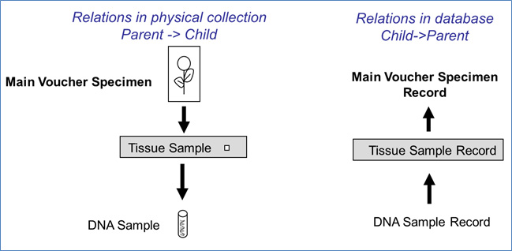
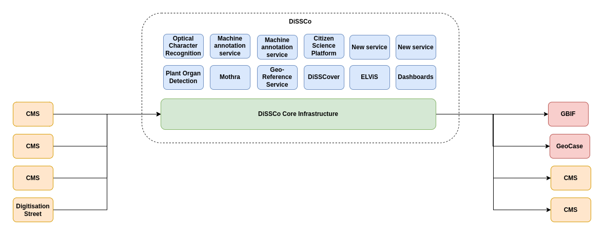
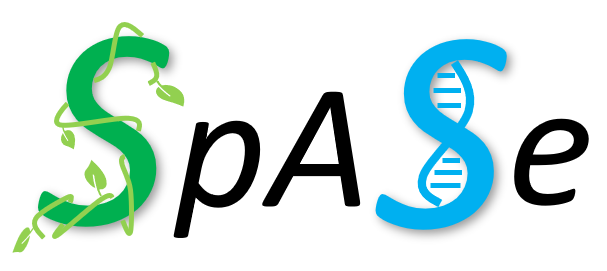
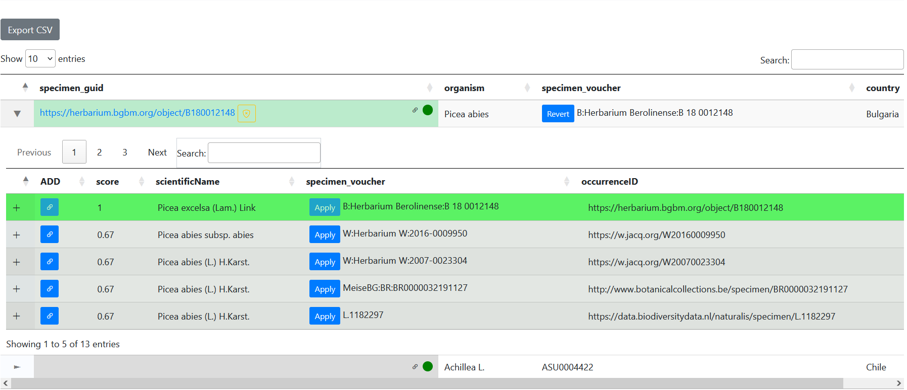

# Documentation
Document APIs and data models for the different infrastructures involved

## ENA

The European Nucleotide Archive is an open platform for the management, sharing, integration, archiving and dissemination of sequence data. 
Is is the European node of INSDC (International Nucleotide Sequence Database Collaboration) together with NCBI (National Centre for Biotechnology Information) and DDBJ (DNA Data Bank of Japan).
The ENA’s metadata model is described [here](https://ena-docs.readthedocs.io/en/latest/submit/general-guide/metadata.html).

Sample metadata standards can be found [here](https://www.ebi.ac.uk/ena/browser/checklists). 
And the INSDC [feature table](https://www.insdc.org/submitting-standards/feature-table/), that includes the description of the source features is also documented [here](https://www.ebi.ac.uk/ena/WebFeat/).

ENA has extensive APIs enabling programmatic access to data held within ENA.

### Portal API -
[API Documentation](https://www.ebi.ac.uk/ena/portal/api/) is available publically to understand the usage of the various endpoints available related to this functionality. 
The APIs allow a search to be performed against different sets of data, which can include a mixture of public and pre-publication (private) data. 
Further API documentation can be accessed [here](https://docs.google.com/document/d/1CwoY84MuZ3SdKYocqssumghBF88PWxUZ/edit).

### Source Annotation Helper -
Source Annotation Helper Application is a Programming Interface (API), to help users accurately report biological source-related sequence and sample attributes.  
This tool currently focuses on the attributes in which specimens, cultures or other materials are identified, from which the sequence data were derived, and uses curated data to obtain the unique codes for the institutions and collections holding the vouchers. 
The API is available at https://www.ebi.ac.uk/ena/sah/api/.

### Taxonomy API -
ENA taxonomy REST APIs to allows users to access information about taxonomy or related records in several ways. The API is available at https://www.ebi.ac.uk/ena/taxonomy/rest/.
Further documentation can be accessed [here](https://ena-docs.readthedocs.io/en/latest/retrieval/programmatic-access/taxon-api.html).

### XREF API -
The ENA Xref service holds cross-references to a number of external data resources linked to ENA records. 
These cross-references can be explored programmatically using the [Xref API](https://www.ebi.ac.uk/ena/xref/rest/swagger-ui/index.html) which is documented with a Swagger interface. 
Further documentation can be accessed [here](https://ena-docs.readthedocs.io/en/latest/retrieval/programmatic-access/cross-reference.html).

## GGBN
GGBN does not have a record level API yet. The general scope and model of GGBN is best described in this paper: https://library.ggbn.org/share/s/xslU9MqCT5mgAIfRukyk8A (Droege et al, 2014, The GGBN Data Portal, NAR 742 (D1):D607-D612). 
Our model is centred around a physical collection object in contrast to DwC which is based on occurrences. 
This physical object has relationships/associations to other physical collection objects. 
These are provided as one directional relationships using the relatedResource class in DwC and the UnitAssociation class in ABCD.

The harvester collects all these associations and builds relationship trees upon it, e.g. two DNA samples refer to the same tissue sample. 
In the portal all related objects are connected and these connections are visible.

The GGBN Data Standard serves as an extension for both DwC and ABCD, more information can be found in this paper: https://library.ggbn.org/share/s/E3qbuKsJSwaI67IWItXCKw (Droege et al, 2016, GGBN Data Standard Specification, Database. baw125) and here: https://wiki.ggbn.org/ggbn/GGBN_Data_Standard_v1
Guidelines on how to apply the standard for providing data to GGBN are given here: https://wiki.ggbn.org/ggbn/Mandatory_and_recommended_fields_for_sharing_data_with_GGBN

The INSDC and BOLD numbers are provided through ggbn:geneticAccessionNumber and ggbn:BOLDProcessID as part of the GGBN Data Standard. Both are repeatable elements. 
Currently no syntax or quality check is performed on these two terms during the GGBN harvesting process, but both are searchable and visible in the data portal. 
In addition we store the used marker (COI, CR etc.) in the field ggbn:marker.

The single record always shows identification and gathering information first and at the bottom of the page you’ll see the individual related physical objects plus sequences and multimedia (if applicable)

Example Sequences, Tissue and Specimen:
https://www.ggbn.org/ggbn_portal/search/record?unitID=MSB%3AMamm%3A87492&collectioncode=Mamm&institutioncode=MSB&guid=http%3A%2F%2Farctos.database.museum%2Fguid%2FMSB%3AMamm%3A87492%3Fpid%3D2186420

Example: DNA sample, Sequences (INSDC & BOLD), Specimen
https://www.ggbn.org/ggbn_portal/search/record?unitID=CNPAK003-13&collectioncode=BIOUG-DNA&institutioncode=University+of+Guelph%2C+Centre+for+Biodiversity+Genomics&guid=DNA-BIOUG06794-D12

Example: DNA sample, Sequences, Multimedia
https://www.ggbn.org/ggbn_portal/search/record?unitID=USNM+1609740&collectioncode=IZ&institutioncode=USNM&guid=http%3A%2F%2Fn2t.net%2Fark%3A%2F65665%2F339b95ba6-4685-44de-889c-f1abdf2cd08d

## DiSSCo
The Distributed System for Scientific Collections (DiSSCo) aims to accelerate the digitisation of specimen data from natural history collections. 
On the technical side we will build a platform for working with specimen data. 
This development is being done with three developers which are all present at the hackathon (Sou, Tom and Sam). 
We are in active development with changes pushed daily (https://github.com/DiSSCo). 
DiSSCo currently does not have a production environment yet, we do have a test and accepted environment.
Within this platform we work with the concept of the Digital Extended Specimen (DES). 
A DES is a specimen connected to all relevant data about the specimen. 
Within DiSSCo we will do this through the use of entityRelationships. 
The entityRelationships together with other parts of our model is based upon the new GBIF Unified Model.
DiSSCo is therefore interested in participating in this project.
On one side it would be beneficial to get our developers better informed about the existing datasets, such as GGBM and how they approach data linkages. 
On the other side to better understand the ENA data and their API possibilities. 
In the end we hope that the developments we make for GGBN could also be included in DiSSCo.
In the DiSSCo platform external source can produce annotation on the specimen. 
These annotations can come from different sources. 
Through our frontend a user can add an annotation to the specimen indicating that there is for example a relevant link with a record in ENA or GGBN. 
This can also be automated with the use of our API.
However, there is also a third option which is to create a Machine Annotation Service (MAS). 
These MAS is a piece of software that produces annotation on digital objects. For creating linkage to the DNA/tissue samples we could make a small service which provides the look-up in ENA and creates the annotation. 
The MAS can then be called for one or multiple specimen.

### API Documentation:
We documented our APIs with the help of Swagger. For the test environment it can be found here:
https://dev.dissco.tech/api/swagger-ui/index.html#/

### Datamodel documentation:
We documented our datamodel in github at: https://github.com/DiSSCo/openDS/tree/master/data-model

### DiSSCo as a platform
The above image shows how DiSSCo will function as a platform. On the left side are data provides, mainly Collection Management Systems. In the middle is the DiSSCo platform. Here we will:
- Harmonise the incoming data (serialisation, terms, values)
- Mint DOIs for each specimen and digital media (handles for other objects)
- Version data and provide provenance (who changed what when and store all historic versions)
- Provide the ability to add annotations to the specimen
- Provide the ability to link the specimen to other data sources
- Provide the ability to correct and extend the specimen data
- On top of the DiSSCo infrastructure service can be build that take action on the data. These could be the previous-mentioned machine annotation services, machine agents working on the data. It could also be through human-aimed platforms build on top of DiSSCo.

## SpASe
SpASe is a web service developed as part of work package 7 in the BiCIKL project. 
It aims to search in different information systems (currently DiSSCo, GBIF, IDigBio) for resolvable specimen IDs that match the input metadata of a given specimen. 
For this purpose, it constructs different combinations of search parameters, which, fed with the input values, are used for the queries. 
The set of specimens from the various search results are subsequently evaluated for similarity and returned to the user sorted accordingly. 
This is the basic workflow of SpASe’s search API. 
In addition, SpASe provides a user interface that enables the upload of flat and CSV files, which contain information about one or more specimens. 
The web service extracts this information and, using the API, searches for suitable specimen registrations, which are subsequently displayed in tabular form. Further, the SpASe UI proposes specimen vouchers that are preferably complete DwC triple identifiers. 
The user can then select between the proposed identifiers and download the adjusted data in a file of the same format as that of the input file.

### Project repository:
https://git.bgbm.org/bicikl/wp7-web-service

### API documentation:
https://git.bgbm.org/bicikl/wp7-web-service/-/blob/master/backend/doc/openapi.json

### Example API request:
https://services.bgbm.org/spase/api/specimen/guid?organism=Picea%20abies&specimen_voucher=B%2018%200012148&country=Bulgaria

### Example UI input files:
https://git.bgbm.org/bicikl/wp7-web-service/-/tree/master/tests/examples

## GBIF

GBIF uses the clustering algorithm. This blog post explains the rules behind the clustering algorithm: https://data-blog.gbif.org/post/clustering-occurrences/

## PlutoF
