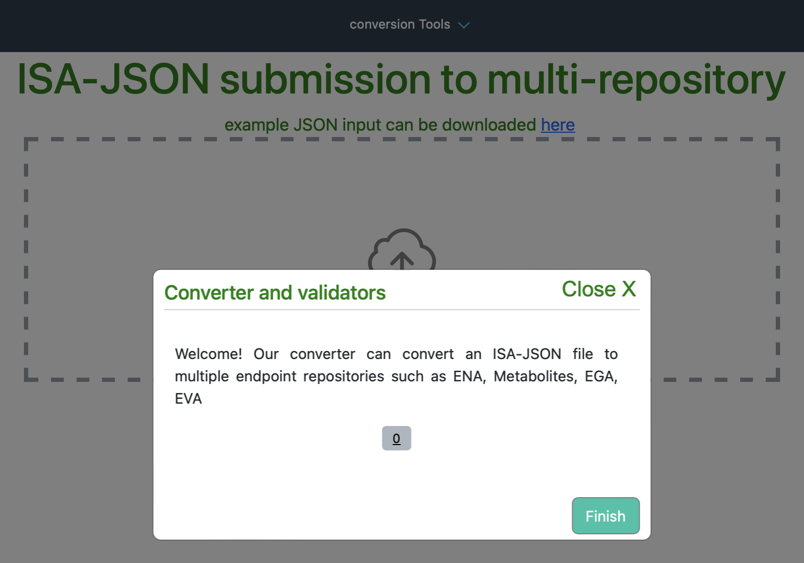
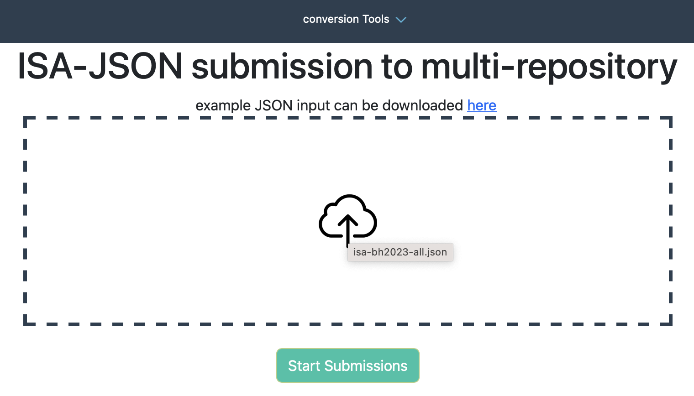
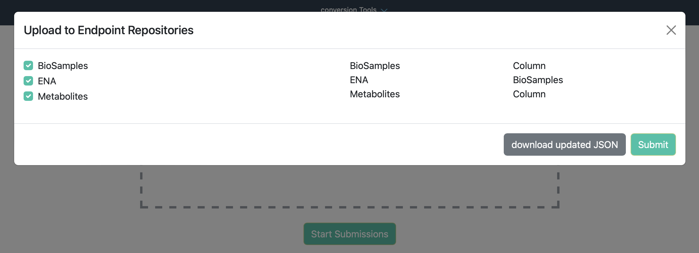

# MARS: Multi-omics Adapter for Repository Submissions

## Introduction
MARS is a data brokering system for submitting multi-omics life sciences studies to multiple specialized repositories.
MARS is a versatile and modular Multi-Repository ISA Submission Framework that enables data producers and multiple data repositories to exchange information seamlessly using the same standardized ISA-JSON format. Unlike a centralized platform, MARS operates as a common framework, allowing for decentralized data submissions while ensuring consistent interpretation and validation of ISA-JSON containing metadata across various repositories.
MARS serves as a common ground where data producers and diverse data repositories can interact cohesively, sharing scientific metadata encoded in ISA-JSON format. The framework ensures mutual understanding and accurate interpretation of the data, preserving the important links between multi-omics data generated from the same biological source.

## Resources
| URL  | Description  |
|---|---|
| [Documentation](https://github.com/elixir-europe/biohackathon-projects-2023/blob/main/27/mars_documentation.md)  | Documentation about the MARS tool  |
| [Web UI access](https://xrzhou.com/mars/) | Domain hosting the Web UI and javascript module  |
| [Web UI code](https://github.com/elixir-europe/biohackathon-projects-2023/tree/main/27/web)  | Code of the Web UI and javascript module  |
| [ISA-JSON to ENA code](https://github.com/elixir-europe/biohackathon-projects-2023/tree/main/27/ISASRAProject27)  | Code of the service that consumes the BioSamples accessioned ISA-JSON, parses and submits it to ENA  |
| [ISA-JSON to BioSamples code](https://github.com/elixir-europe/biohackathon-projects-2023/tree/main/27/ISABioSamplesProject27)  | Code of the service that consumes the ISA-JSON, parses and submits it to BioSamples |
| [BioSample external reference extender](https://github.com/elixir-europe/biohackathon-projects-2023/tree/main/27/biosamples-externalReferences)  | Code used to extend the existing BioSample records with the external references of the data submitted to other archives |

## Components in MARS
MARS is comprised of distinct components, each representing key roles in the data submission process. Together, they form the essential building blocks of MARS, enabling cohesive and reliable data submission to multiple repositories.
Each role performs specific functions and carries distinct responsibilities essential for the smooth operation of the system.

### End-User
This individual is the user who inputs experimental metadata and location of related data files into ISA-JSON Producer platforms. End-User provides essential experimental details that are encoded into ISA-JSON format.

End-User could be also direct user of the Data Broker platform, particularly in scenarios where the broker platform is only accessible as a web service within the institute's intranet.
* Main function: 
  * Input experimental metadata into ISA-JSON Producer platforms following the specific rules, structures, and requirements of the respective platform. 
  * Use the ISA-JSON producer platfom to expor experimental metadata in ISA-JSON files and uploading them to the Data Broker platform.
* Responsibilities:
  * End-User ensures the accuracy and completeness of metadata.
  * End-User must refrain from uploading identical ISA-JSON files to the Data Broker platform, unless it is to initiate a distinct action such as update or release.

### ISA-JSON producers
This role includes any source of ISA-JSON files containing the metadata of multi-omics research. For example, research infrastructure or service facilities that operate platforms such as ARC, FAIRDOM-SEEK, ISA Creators. 

* Main function: Prepare research metadata in ISA-JSON format (i.e. generate and export ISA-JSON files)
* Responsibilities:
  * Ensure compliance of the submitted ISA-JSON with the ISA model expected by MARS.
  * Validate ISA-JSON structure and fields in ISA-JSON as expected by MARS (e.g. “Comment[Target repository]” at Assay level). This includes verification of the checksums associated to the data files. This step might also include validation of repositories’ checklists, controlled vocabulary lists, ontology terms etc, if validation rules are provided by each repository for MARS.
  * Assert that files referenced within the ISA-JSON metadata are uploaded to the target repositories. For example, if a FASTQ file is referenced in an assay that would be submitted to ENA, this file should exist within the storage of ENA. The ISA-JSON metadata payload should contain the checksums associated to the data files (this is requirement for SRA based repositories)
  * Use credentials for submission that the target repositories accept. For example, to submit to ENA, credentials for a submission account of ENA would be required.
 
### Data broker
This role includes a research infrastructure or service facilities that operates a platform designed to streamline the data submission process to repositories. This platform serves as the intermediary element in MARS: facilitating seamless submission of (meta)data to the target repositories. Data brokers play a vital role in ensuring the smooth flow of information within the system, connecting data producers with repositories effectively and securely
* Main function: Submit to the target repositories the provided ISA-JSON 
* Responsibilities: 
  * Deliver the ISA-JSON to the repositories without any loss of information.
  * Extend the ISA-JSON with additional information provided by the archives. For example, the accessions assigned to the submitted objects.
  * Handling the submission process as an intermediary between the producers and repositories.
  * Informing the producers effectively about the status of the submission to the target archives. For example, if there were any errors, and providing the extended ISA-JSON.
  * _TBD: #! once decided on how credentials/token/AAI are handled_
  * To ensure that the brokering account is not used beyond the purposes defined by the producer. In other words, not to modify or submit in the name of the producer without their consent.
The data broker can have an ENA brokering account or not. The data brokering tool or service can be used with a personal account for data repositories.
Data broker reads receipts generated by the repositories and add the information into the ISA-JSON.

## Target Archives
This role includes any omics archive that joins the MARS approach, facilitating a submission through the data broker platform. The goal of MARS is for submissions to these repositories to be made in a similar way through metadata in ISA-JSON files.
* Main function: to ingest an ISA-JSON file and use it to submit the metadata it contains to its own archive
* Responsibilities
  * To maintain a service through which the data brokering platform can send the ISA-JSON
  * To create a process that will transform the received ISA-JSON into a suiting format for the submission of their archive. That is, if the archive does not accept natively ISA-JSON
  * To register the metadata targeted to the archive contained in the ISA-JSON
  * Ensure that the response given to the data broker conforms to the given standards. See https://github.com/elixir-europe/biohackathon-projects-2023/blob/main/27/repository-api.md 

# #! To be discussed:
- Handling brokering accounts: who creates it? Same for all repositories? Who handles requests to broker data? Can it be done automatically? Are all namespaces for submissions would be shared? Check: https://ena-docs.readthedocs.io/en/latest/faq/data_brokering.html

## Diagram
````mermaid
graph TD
    start((START)) --> ISA-JSON
    style start fill:#FFFFFF,stroke:#333,stroke-width:5px
    inform --> endNode{{END}}
    style endNode fill:#E0E0E0,stroke:#333,stroke-width:5px
    subgraph User/JSON Producer
        targetRepo(Define Target repositories) -->|Add comment to ISA| ISA-JSON
        ISA-JSON
        Credentials
        Files
        Files --> |Addition\nof Checksums| ISA-JSON
        fix(Fix error)
        style fix fill:#FF9999,stroke:#333,stroke-width:2px
        inform(Retrieve extended ISA-JSON)
    end

    subgraph Broker platform
        ISA-JSON --> |Upload| isa[ISA-JSON]
        Credentials --> |Upload| credentials[Credentials]
        Files --> |??????| files[Files]
        isa --> validation{Validate\nISA-JSON}
        validation --> |No| fix
        validation --> |Yes| sendIsa(API call)
        style sendIsa fill:#F5F906,stroke:#333,stroke-width:2px
        credentials --> sendIsa
        updatedIsa[Updated ISA-JSON]
        updatedIsa --> sendIsa2(API call)
        style sendIsa2 fill:#F5F906,stroke:#333,stroke-width:2px
        credentials --> sendIsa2
        files --> sendIsa2
        responseDec2 --> |Yes: Extend\nISA-JSON|updatedIsa2
        updatedIsa2[Updated ISA-JSON]
        updatedIsa2 --> extensionBS(Download BioSamples JSON &\nExtend External References)
        extensionBS --> sendIsaBsFinal(API call)
        responseDec1{Correct\nResponse}
        responseDec1 --> |Yes: Extend\nISA-JSON|updatedIsa 
        responseDec1 --> |No| fix
        responseDec2{Correct\nResponse}
        responseDec2 --> |No| fix
        style sendIsaBsFinal fill:#F5F906,stroke:#333,stroke-width:2px
    end

    subgraph BioSamples
        sendIsa --> |Send ISA-JSON| readIsa(Read and Transform ISA-JSON)
        readIsa --> registerBs(Register BioSamples)
        registerBs --> checkBS{Correct\nsubmission}
        checkBS -->|Yes| receipt1[Response with\nBioSample accessions]
        checkBS -->|No| receipt1no[Response with\nerrors]
        receipt1no --> |Send| responseDec1
        style receipt1no fill:#FF9999,stroke:#333,stroke-width:2px
        receipt1 --> |Send| responseDec1
        sendIsaBsFinal --> |Resubmission as \nModification| modifyBiosamples(Modify existing BioSamples)
        modifyBiosamples --> inform
        style BioSamples fill:#92FBA9,stroke:#333,stroke-width:2px,stroke-dasharray: 5, 5
    end

    subgraph Archives
        sendIsa2 --> g_read(Read and Transform ISA-JSON)
        g_read --> g_register(Register objects)
        g_register --> g_check{Correct\nsubmission}
        g_check -->|Yes| g_receipt[Response with\nArchived accessions]
        g_check -->|No| g_receiptno[Response with\nerrors]
        g_receiptno --> |Send| responseDec2
        style g_receiptno fill:#FF9999,stroke:#333,stroke-width:2px
        g_receipt --> |Send| responseDec2
        updatedIsa2
        style Archives fill:#3BF9F9,stroke:#333,stroke-width:2px,stroke-dasharray: 5, 5
    end

    subgraph ArchiveList
        ENA
        MetaboLights
        edal-PGP
    end

    ArchiveList -.- Archives
````
## How to try out the MARS prototype

### 1. Clone the repository or access the server
Clone the [elixir-europe/biohackathon-projects-2023](https://github.com/elixir-europe/biohackathon-projects-2023/tree/main) GitHub repository or connect to the VM?

### 2. Open the web interface
Open the [web interface](https://github.com/elixir-europe/biohackathon-projects-2023/blob/main/27/web/index.html).


    
### 3. Upload the multi-omics ISA-JSON file
Click on upload icon and select the file [isa-bh2023-all.json](27/isa-test-data/ISA-BH2023-ALL/isa-bh2023-all.json).



Select the target archives you want to send your multi-omics (meta)data to and and click `Start Submissions`. The archives selected should correspond to the target archives indicated in the ISA-JSON file.



### x. Validate the ISA-JSON
Validation step to be done.

### 4. Start submission to BioSamples
Data broker uses [this code](?) to make an API call to the BioSamples service "ISA-JSON to BioSamples code".

### 5. Register samples in BioSamples
The API call from the data broker triggers the running of the [ISA-JSON to BioSamples code](https://github.com/elixir-europe/biohackathon-projects-2023/tree/main/27/ISABioSamplesProject27): code of the service that consumes the ISA-JSON, parses and submits it to BioSamples. 

[Example of ISA-JSON that the data broker sends to BioSamples](https://github.com/elixir-europe/biohackathon-projects-2023/blob/main/27/biosamples-input-isa.json).

### 6. Update the ISA-JSON with BioSamples information
After a succesful submission, BioSamples sends to the data broker an updated ISA-JSON containing BioSamples accession numbers for `Source` and `Sample` as `Source characteristics` and `Sample characteristics`, respectively.

[Example of ISA-JSON that BioSamples sends back to data broker](https://github.com/elixir-europe/biohackathon-projects-2023/blob/main/27/biosamples-modified-isa.json).

Data broker replaces or updates the original ISA-JSON.

### 7. Dispatch submissions to other target archives
Data broker uses [this code](?) to make an API call to the other target archives service "ISA-JSON to archive X code".

### 8. Register linked records in other archives
The API call from the data broker triggers the running of the
* [ISA-JSON to ENA code](https://github.com/elixir-europe/biohackathon-projects-2023/tree/main/27/ISASRAProject27): code of the service that consumes the BioSamples accessioned ISA-JSON, parses and submits it to ENA.
* ISA-JSON to MetaboLights code
* ISA-JSON to eDAL-PGP code

### 9. Update the ISA-JSON with other archives' information
After a succesful submission, each archive sends to the data broker a receipt in a standard format defined for MARS (see example below). The receipt contains the path of the ojects in the ISA-JSON for wich an accession number has been generated, and the related accession number. The structure of the receipt is generic and common for all archives that joins MARS.

[image]

Data broker replaces or updates the original ISA-JSON.

### 10. Update BioSamples External References
Data broker uses the BioSamples accession numbers to download the submitted BioSamples JSON and extend the `External References` schema by adding the accession numbers provided by the other target archives.

[image or link]

