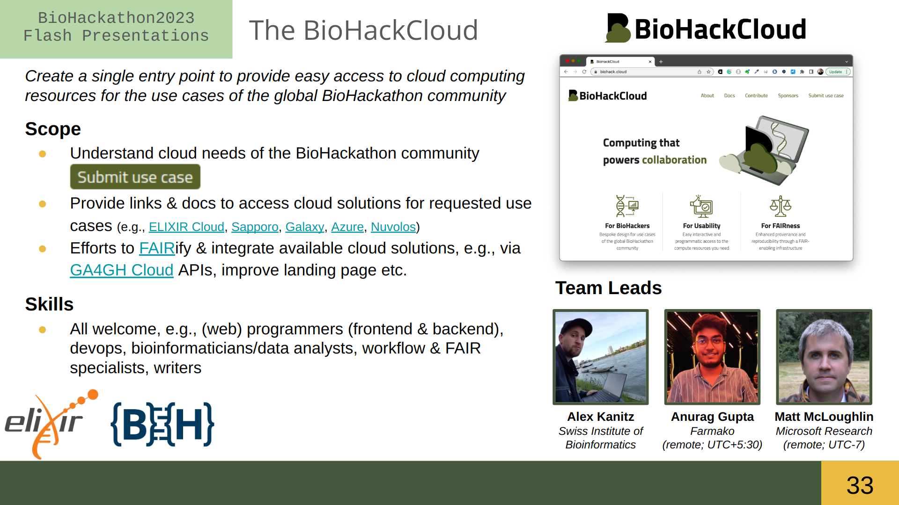

# Project 33: The BioHackathon Cloud

> ***Click on slide to listen to a 2-min introduction***

## Overview

Welcome to the [**BioHackCloud**](https://biohack.cloud/) project, a continuous effort to help BioHackers access cloud computing resources for their projects. The BioHackCloud was kicked off during the 2023 edition of the DBCLS BioHackathon in Japan and will try to provide cloud resources for this and future BioHackathons.

The BioHackCloud is not a cloud infrastructure in itself. Rather, it will provide a convenient entry point for BioHackers to make use of available cloud infrastructures/solutions, such as the [ELIXIR Cloud](https://elixir-cloud.dcc.sib.swiss/), [Sapporo](https://github.com/sapporo-wes/sapporo), [Galaxy](https://usegalaxy.org/), [Microsoft Azure](https://azure.microsoft.com/) or the [Nuvolos Cloud](https://nuvolos.cloud/).

**A use-case driven cloud**

The BioHackCloud focuses on supporting use cases that BioHackers typically face, e.g., executing non-trivial containerized compute jobs, sharing big data with team mates, collaboratively accessing Jupyter notebooks. Use cases can be [submitted] by the BioHackathon community and are then evaluated by the team for support. If we _can_ support a use case right away, we will prepare the necessary documentation both for ourselves to set up any necessary deployments and for end users to access the recources. The end user documentation will then be published on the [BioHackCloud website](https://biohack.cloud/) for future use. Deployment instructions will be instead be stored in the [BioHackCloud GitHub organization](https://github.com/biohackcloud/).

> Please note that currently, there are no use cases supported yet!

**A standardized, FAIR cloud**

Apart from just linking out to available cloud computing solutions and documenting their use for particular use cases, we are also interested in advancing the FAIRification and integration of different cloud solutions. To achieve this, we will preferentially consider cloud solutions that adopt community standards for interoperability, such as the [GA4GH Cloud](https://www.ga4gh.org/work_stream/cloud/) APIs or relevant [RO-Crate](https://www.researchobject.org/ro-crate/profiles.html) profiles.

## Hacking goals

The following table lists the main (in bold) and side goals for the 2023 ELIXIR BioHackathon, as well as skills that will be useful in achieving these:

> **As you can see, we can make use of many different backgrounds, skills and interest. So please consider joining the team and making the BioHackCloud a useful asset for the BioHackathon community** :rocket:

| Goal | Description | Useful skills |
| --- | --- | --- |
| **Understand cloud needs of BioHackathon community** | Set up, share and promote a use case survey among BioHackathon participants | Any |
| **Evaluate use cases** | Evaluate, understand and prioritize use cases | Bioinformaticians, data analysts |
| **Plan use case support** | Plan support for use cases during this and future BioHackathon events; create roadmap | Bioinformaticians, data analysis, cloud specialists |
| **Implement use case support** | Select one or more use cases to implement support for | Cloud, workflow and container specialists |
| Improve website | Improve features and usability of BioHackCloud landing page | Frontend programmers |
| Integrate cloud solutions | Work packages towards the better integration of cloud solutions via community standards | Cloud specialists, backend programmers |

## How we work

The following bullet points will give you a basic idea of what working on the team will look like:

- To get to know the team, set more narrow goals, distribute work packages across team members, and discuss administrative issues, we will have a kick-off call at 4:30pm CET in [Zoom](https://elixir-europe-org.zoom.us/j/87108266423?pwd=SVRNeEtsY1ArZ2ZjM3htTTN4TTBhQT09). Make sure to join the project's breakout room. If you would like to participate, but can't make the meeting, please drop a message in the [Slack channel](https://biohackeu.slack.com/archives/C03HQPMEN81), where you briefly introduce yourself and list any relevant skills and interests.
- Our [Slack channel](https://biohackeu.slack.com/archives/C03HQPMEN81) will be the primary focus point for communication with the entire team.
- Depending on the team's makeup (number of participants, F2F vs. virtual participation, time zones), we may decide for daily stand-up meetings.
- End-user and admin documentation for supported use cases will be published/stored on the [BioHackCloud website](https://biohack.cloud/) and a dedicated repository in the [BioHackCloud GitHub organization](https://github.com/biohackcloud), respectively; where to store any other outputs (roadmap, demos/tutorials etc.) will be decided on the go and broadcast in the Slack channel

## Resources

- [Slack channel](https://biohackeu.slack.com/archives/C03HQPMEN81)
- [Zoom link](https://elixir-europe-org.zoom.us/j/87108266423?pwd=SVRNeEtsY1ArZ2ZjM3htTTN4TTBhQT09) (choose the appropriate breakout room)
- [BioHackCloud website](https://biohack.cloud/)
- [BioHackCloud GitHub organization](https://github.com/biohackcloud)

## Leads

| Name | Affiliation | GitHub | LinkedIn |
| --- | --- | --- | --- |
| **Alex Kanitz** | Swiss Institute of Bioinformatics, Switzerland | [URL](https://github.com/uniqueg) | [URL](www.linkedin.com/in/alexanderkanitz/) |
| **Anurag Gupta** | Farmako, India | [URL](https://github.com/git-anurag-hub) | [URL](https://www.linkedin.com/in/anurag-gupta-1201/) |
| **Matt McLoughlin** | Microsoft Research, United States | [URL](https://github.com/MattMcL4475) | [URL](https://www.linkedin.com/in/mattmcl44/) |

